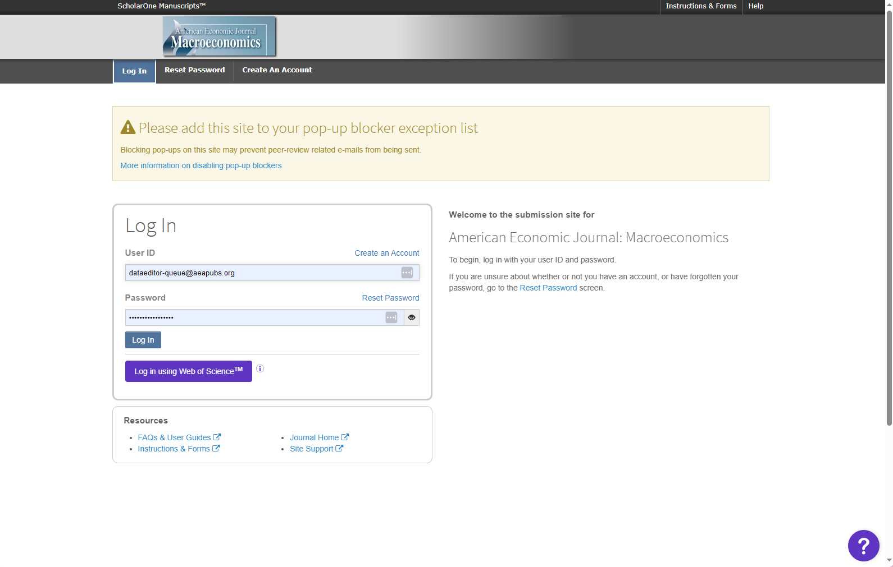
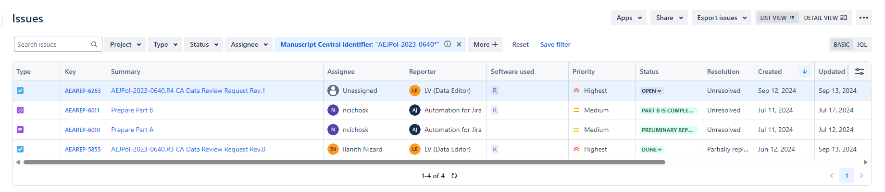

# Checking Unassigned Jira Tickets

## Basic Instructions

- Go the unassigned filter in Jira (Dashboards > Admin Dashboard > AEA tasks by Assignee section > scroll down to “Unassigned”).
- In the most recent cases, fill out the following info from the DCAF attached:
    - DCAF_Access_Restrictions
        - if “Yes, data can be made available privately”, do additional [steps](https://aeadataeditor.github.io/LDI-Research-Aide/procedures/Requesting_Restricted_Access_Data/)
    - DCAF_README_checked
    - openICPSR Project Number
    - Software Used (from openICPSR deposit)
        - When checking the software in the openICPSR deposit, open the README and make sure it exists. If there is no README in the openICPSR deposit or the deposit is empty, make a [short report](https://aeadataeditor.github.io/LDI-Research-Aide/procedures/Writing-Short-Report/).

- Check that there is a manuscript attached, and add one if not.

## If no manuscript in the Jira ticket

- Go to “Other Links” and click on the MCEntryURL.
- After logging in, click “Review”. Ctrl+F and search for the Manuscript Number.
- Once you find the manuscript, go to the Action section, “View Proof”, download the PDF of the manuscript.

- Attach the PDF to the Jira ticket.

## RR Papers

If the MC Status field is RR ("Invitation to Review")

- Go to MCEntryURL in the ““Other Links” section
- Log in to ScholarOne and click Review.

- Navigate to the link that says “Invitations”

- Ctrl+F for the manuscrip number.
- Click “Agreed and begin review”
- Then close out the tab.

## Check if case is a revision:

Check if the case is a Revision by going to the Other Links tab and clicking the JiraSearchMC. If there are other Jira issues (not subtasks or FYIs), then it is a Revision.

- Link the Revision: Go back to the main Task you were editing, click “Link issue” > “Is a Revision of” and then input the AEAREP number of the older task.

- Update MCStatus to include ‘Revision’ if it doesn’t already have it.
- Update the bitbucket short name with the repository name of the previous cases.
- Check if the older Jira ticket had restricted access data (i.e. Working location of restricted data was filled out). If yes:
    - Link Issue, select type “relates to” and add the aearep-xxx for the subtask “Request Restricted Access Data for AEAREP-nnn”
    - Fill out Working location of restricted datawith the same L drive path
    - Fill out Agreement Signed to match the older Jira ticket

## Additional Steps for Restricted Access Data
- Check if the case is a Revision:
    - If yes, check that we haven’t already asked for the Restricted Access Data.
    - If yes, link the existing subtask to the most recent revision.
    - If no, continue to next step.

If not a revision:

## Requesting Restricted Access Data from Authors

For cases where the author(s) have indicated on the DCAF that they can make restricted-access data available to the Data Editor privately, follow these steps:

1. Create a subtask (issue type: confidential data) in the main Jira task. Title it "Request Restricted Access Data for AEAREP-xxx". This subtask will be aearep-nnnn
1. Navigate to the following [directory](https://cornell.app.box.com/folder/144685329952) in Box: "Box/LDI Replication Lab/Office of AEA Data Editor/Restricted-Access-Data/"
2. Create a new subfolder corresponding to the main Jira issue (`aearep-xxx`). 
3. Create a [file request](https://support.box.com/hc/en-us/articles/360045304813-Using-File-Request-to-get-Content-from-Anyone) within the newly created subfolder (only one file request is permitted per folder).  
4. Copy the file request link.
5. Email the authors to request that they upload the restricted-access data files to Box using the template below: 

Subject Line:
<blockquote>

Request for Restricted Access Data (AEAREP-xxx)
</blockquote> 

Send it to authors, cc to dataeditor-queue@aeapubs.org and dataeditor@aeapubs.org.

Dear Dr. *Author*,
<blockquote>
We received a request to conduct the AEA reproducibility check for your manuscript entitled "X." On the Data and Code Availability form which you submitted it was indicated that the data can be made available to the Data Editor privately. Would it be possible for you to provide the restricted-access data so that we may proceed to verify the reproducibility of the entire replication package? The data would not be published, and would be deleted by us once we have completed our process. Our preferred sharing method is a Box File Request (specific to your manuscript), the link for which can be found below, but can alternatively happen via Dropbox or similar means, and should be compliant with your data use agreement.

Box File Request (navigate to the link below and upload the file(s)):
[Insert Box File Request Link Here]

We note that all data sharing with the Data Editor should be in compliance with all applicable data use agreements. Please check before sharing.

Please note that the replicator will ignore any code or public data sent via Box. For more information on what to share with the Data Editor:
https://www.aeaweb.org/journals/data/faq#confidential
https://aeadataeditor.github.io/aea-de-guidance/preparing-for-data-deposit.html#structure-in-the-presence-of-confidential-unpublished-data

For more guidance on how to legally and practically share restricted data with the Data Editor:
 https://aeadataeditor.github.io/aea-de-guidance/sharing-restricted-data.html

If you have any questions please do not hesitate to ask.
Thank you!
</blockquote>

### Once data is obtained

- Box will email you about changes made to Box folder (set up these notifications)
    - Special case: Author provides Dropbox or other link to download
    - Download from the provided link, and upload into Box. Then proceed as usual.
- Download the data in CCSS Cloud at add it to `L:\Restricted-Access-Data` in a folder titled `aearep-xxx-nda_Implicit`.

- Go into Jira ticket for AEAREP-xxx, under *Data Info*, edit fields:
    - Agreement signed: `NDA`, `Implicit`
    - Working location of restricted data: `L:\Restricted-Access-Data\aearep-xxx-nda_Implicit`
- Comment in the Jira ticket *"Restricted access data added: L:\Restricted-Access-Data\aearep-xxx-nda_Implicit"* and tag the RA currently assigned to run the code.

## Non-standard unassigned cases

When you get a Jira ticket titled `"Contact form submission (researcher@university.edu, FirstName LastName)"`, often these are in reference to openICPSR deposit that have already been published. The message is from someone reviewing the deposit and found something concerning, like a missing code file or potential PII.

- Review the message in the `Primary Info Section`.
- Using the DOI or article titled provided, search for the Manuscript Identifier
- Fill out the `Journal` field and the `Manuscript Central Identifer` field
- Mark the `MCStatus` as Update and fill out the `Update Type` (under Other Links) as the appropriate label, depending on who is contacting us.
- Depending on what the email says, you may have to contact the authors of the original deposit or Kyrani for technical issues.

**These email templates are specific examples. Please edit the content to match the issue in question.**

Here is an email templates for the author of the package in question

> Action needed for your published replication package "Title" (AEAREP-xxx)

<blockquote>

Hello Dr. XXX,
We were contacted by a researcher about your replication package for "Title" (https://www.openicpsr.org/openicpsr/workspace?goToPath=/openicpsr/[000000]). Due to a bug in openICPSR, the file [code/01_simulation/archive_functions.R] is empty. Could you please update the replication package with the necessary code?

These are the directions on how to update an already published replication package.
https://aeadataeditor.github.io/aea-de-guidance/FAQ.html#i-was-wondering-whether-and-how-i-can-update-the-published-repository-for-our-paper-i-was-contacted-by-a-researcher-who-is-doing-a-replication--couple-of-minor-issues--forgotten-to-include-two-auxiliary-datasets-in-the-repository-without-which-one-of-the-programs-does-not-run-successfully

Thank you so much. Please let us know if you have any questions and notify us once the changes are made.
</blockquote>

Here are some email templates for the person who submitted the contact form.

> Subject: Contact Form Submission Response (AEAREP-xxx)

<blockquote>

Thank you for contacting us about the replication package for the article [MC Number] “Title”.

We have contacted the authors and they've uploaded the file [code/01_simulation/archive_functions.R] to the deposit. The deposit still needs to be published again for you to view it, but I've attached the code in the meantime.

Hope this helps. Let us know if you have any other questions.
</blockquote>

Once the issue has been resolved, move the Jira ticket to `Done`.

