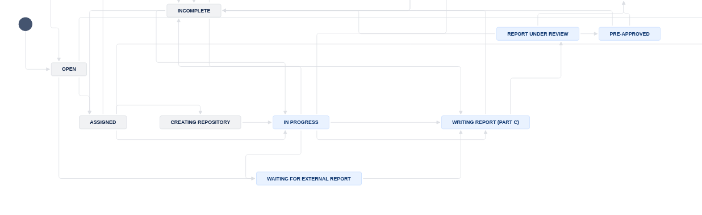
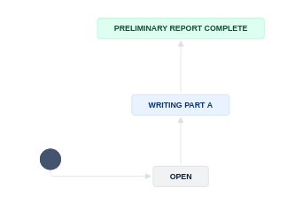
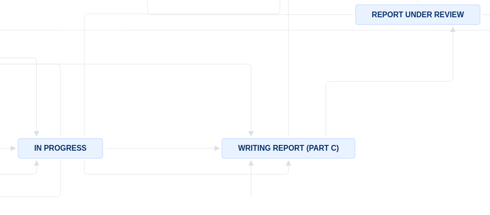

(aea-jira-workflow-a-guide)=
# AEA Jira workflow 

For pre-publication verification, we use a Jira-based workflow to guide the replicator through the process of filling out the report (called `REPLICATION.md`). 

```{note}
The link to JIRA is [https://aeadataeditors.atlassian.net/jira](https://aeadataeditors.atlassian.net/jira) (requires login).
```

## New

```{warning}
For most Jira issues created after 2024-01-30, we use a new workflow. In this, the report is initially split into `REPLICATION-PartA.md` and `REPLICATION-PartB.md`, and subtasks are created for preparing parts A and B. Once both parts are ready, they are merged back into `REPLICATION.md`. 
```

## Scope

Your supervisor will assign you to this workflow. This workflow covers code and data, even when data may not be accessible. Supervisor, see [other document](https://github.com/labordynamicsinstitute/replicability-training/blob/master/jira-supervisor-notes.md) for details.

- This workflow **DOES NOT** cover simple metadata assessment of openICPSR deposits, for instance for AEA Papers and Proceedings deposits. See [Instructions for Papers and Proceedings](aea-pandp-instructions).

## Overview

### Prior to assignment 

AEA manuscripts are checked for compliance with the [AEA Data and Code Availability Policy](https://www.aeaweb.org/journals/policies/data-code) after having been `conditionally accepted` by the journal's Editor-in-Chief (EIC) or Co-Editor (which we'll call "the editor" collectively).[^exceptionaej] Once authors have received the editor's "Conditional Acceptance" email, they send their manuscript materials to the  AEA Editorial Office, together with the [AEA Data and Code Availability Form (DCAF)](https://www.aeaweb.org/journals/forms/data-code-availability). It is the **DCAF** which identifies where the authors have initiated a deposit of their replication package. Usually, this is at the [AEA Data and Code Repository @ openICPSR](https://www.openicpsr.org/openicpsr/search/aea/studies), but it can be at any [trusted repository](https://aeadataeditor.github.io/aea-de-guidance/guidelines-other-repositories). 

[^exceptionaej]: The American Economic Journal: Applied Economics (AEJ:AE) is an exception, because they regularly assign us papers during the "revise-and-resubmit" phase, prior to final acceptance, for a preliminary or early check.

Once the AEA Editorial Office has verified that everything is complete, they assign the manuscript to the LDI Replication Lab. This assignments happens in the manuscript management system "Scholar One", and triggers an email. This email enters our [JIRA system](https://aeadataeditors.atlassian.net/jira) system, and becomes an "open JIRA issue". That's where we start.

### High-level view of flow through our process



An `Open` issue is first evaluated by the a supervisor (the AEA Data Editor or their assistant). The supervisor takes into account the complexity of the case, the known software or data acquisition skills of the replicators, the urgency of the case (for instance, if one of the authors is soon up for tenure), etc. Some of this is already coded into JIRA fields.

Once [`Assigned`](workflow-assigned) a new case, the replicator will [create a new git repository](create-repo), if a brand new case, or reference an existing repository (if the issue is a [revision](aea-revision-reports-after-author-resubmission)) in order to move to `In Progress`. Each manuscript is associated with a single git repository, which tracks the evolution of the author's code, and of our reports and attempts to run it, over time. 

The replicator then copies the author's code  (but not the data!) into the git repository, usually by [using automated scripts](running-populate-icpsr), then adds the manuscript and DCAF as provided by the AEA Editorial Office. The first task is to make an extensive assessment of the replication package in the repository, what we call a [Preliminary Report](parta). This identifies the three key elements of a reproducibility attempt:"

- is the guiding document to the replication deposit (the [README](https://social-science-data-editors.github.io/template_README/)) sufficiently complete and clear to undertake a complete assessment? The replicator is the first reader of this, but the ultimate reader is a future researcher who wants to use the data and code.
- can we access all the data? Is there additional data that needs to be obtained, and how complicated is that? (Some of this may have been signalled by the authors via the [DCAF](https://www.aeaweb.org/journals/forms/data-code-availability) and coded by the supervisor.)
- can we run the code? Do we have access to the software, to the computing hardware to run the code? If not, can we acquire such access in a reasonable time frame?

Once the Preliminary Report is complete, the replicator may discuss this at one of the bi-weekly meetings with the AEA Data Editor, if there are questions. 

If a decision is made to attempt a computational reproduction of the paper, the replicator then proceeds to the next step, [running code](running-code-partb). This involves setting up the computing environment, the project environment, and running the code. Unfortunately, this almost always involves some debugging, and replicators get really good at that! 

If there is too much debugging, or the debugging does not work, we may return it to the authors at this point, for correction of the identified issues, and resubmission. Our report tries to provide as much detail about what the replicator attempted and didn't work, to assist the authors, but is not a full "code consultation", as that is not the role of the journal. 

If the debugging was successful (or not necessary), the replicator will, at this time, have a collection of tables and figures produced by the code. It is time to [compile all this into a report](partc). Tables and figures are compared to the manuscript, to assess for completeness and accuracy. We expect that all results are exactly reproduced, down to the last decimal, unless the README clearly states that this should not be expected (and explains why).
 
Once the report is completed, it is sent back to the authors via the ScholarOne interface, to the AEA Editorial Office. The report will contain the AEA Data Editor's decision, which can be:

- `Accept` - no changes need to be made anywhere
- `Accept with changes` - there are minor changes that need to be made to the manuscript and/or the deposit, but these are not substantive, and do not require re-running code. Manuscript changes are implemented at the copy-editing stage.
- `Conditional accept` - there are substantive changes that need to be made to the manuscript and/or the deposit, and these changes require a full review by the Data Editor, including possibly re-running code.
- `Revise-and-resubmit` - when issues are found that put into doubt the results in the manuscript, the manuscript may need to be reviewed by the editor, or the referees, again. This is never chosen without a prior discussion with the editor, and extremely rare. As of 2024, none such cases have lead to a terminal rejection of the manuscript.


### Details

The following table illustrates the flow and transitions. The `transition` field identifies the button that will appear in the interface
that needs to be clicked in order to progress an issue from the `From` state to the `To` state. The `Condition` field identifies
which form field needs to be filled out in order to be able to make the transition. `Blocked` is always an option, and leads to a "waiting state"
until a resolution can be found.

```{warning}
We regularly tweak the process to respond to needs and changes. The following detailed description may lag behind those tweaks!
```

### Workflow for Main Task


| From         | Transition                  | → To                   | Condition |
|:-------------|:----------------------------|:-----------------------|:----------|
| Assigned     | Create new repository       | → Creating repository  |  Issue is not a `Revision`         |
|              | Bypass repository creation  | → In Progress          |  Issue is a `Revision` , `Git working location` has been filled out        |
| Creating repository | Start Task           | → In Progress          |  `Git working location` has been filled out         |
| In Progress  | Assign to external replicator | →  Waiting for external report        | `External Replication` = `Yes` |
| In Progress  | Write report | →  Writing Report (Part C)        | Subtask Part A= `Preliminary Report Complete`, Subtask Part B = `Part B is complete` |
| Writing Report  (Part C)     | Submit for review    | → Report Under Review  | `Report URL` is not empty.|

At this point, there will be two subtasks: `Prepare Part A` and `Run Part B`. The following transitions are available for each of these subtasks, unless the issue has been assigned to an external replicator.

### Workflow for Part A Subtask




| From         | Transition                  | → To                   | Condition |
|:-------------|:----------------------------|:-----------------------|:----------|
| Open         | Writing preliminary report  | →  Writing Part A      |  |
| Writing Part A | Finished Part A           | →  Preliminary Report Complete |  `Part A` has been filled out         |

### Workflow for Part B Subtask


| From         | Transition                  | → To                   | Condition |
|:-------------|:----------------------------|:-----------------------|:----------|
| Open         | Prepare to run code         | →  In Progress         | Working area has been prepared |
| In Progress  | Start running code          | →  Code is Running     | Some data is available |
| In Progress  | No code can be run          | →  Part B is complete  | No data is available |
| Code is Running | Code is done running     | →  Part B is complete  |  |

It is possible that a Pre-approver or an Administrator move the issue back to `In Progress` when additional debugging or code runs are necessary.

Once both parts are complete, the issue can be merged into `REPLICATION.md` and the final report compiled. This is also true once the external report has been received.


### Continuation of Workflow for Main Task



| From         | Transition                  | → To                   | Condition |
|:-------------|:----------------------------|:-----------------------|:----------|
| In Progress  | Write report       | → Writing Report (Part C)        | `Report URL` is not empty |
| Waiting for external report | Write report       | → Writing Report (Part C)        | `Report URL` is not empty |
| Writing Report  (Part C)     | Submit for review    | → Report Under Review  | `Report URL` is not empty.|
| Multiple     | Need information     | → Incomplete   |  when information is missing |
| Incomplete   | Restart task         | → In Progress  |           |
| Incomplete   | Prepare report      | → Writing Report (Part C)  |           |

The following are only relevant for "Approvers" or "Pre-Approvers" (if you have not been told you are a "(Pre-)Approver", you are not.)

| From         | Transition           | → To           | Condition |
|:-------------|:---------------------|:---------------|:----------|
| Open         | Assign               | →  Assigned    |           |
| In Progress  | Alternate Workflow   | →  Alternate Workflow | |
| Under Review | Approve              | →  Approved    |Can only be done by **approvers**.|
| Pre-approved | Approve              | →  Approved    |Can only be done by **approvers**.|
| Under Review | Pre-Approve          | →  Pre-Approved|Can only be done by **pre-approvers**.|
| .            | Incomplete           | →  Incomplete  | n.a.      |
| Approved     | Done                 | → 	Done       | n.a.      |
| Blocked      | Reopen               | →  Open        | n.a.      |

The following are only relevant for "Publishers"  (if you have not been told you are a "Publisher", you are not.)

| From         | Transition           | → To           | Condition |
|:-------------|:---------------------|:---------------|:----------|
| Approved     | Submit to MC         | →  Submitted to MC    | `MCRecommendationV2` is filled out          |
| Submitted to MC     | Wait for response on ICPSR | → Pending openICPSR changes | `MCRecommendationV2` is `Accepted with changes` and notes to be added on openICPSR  |
| Submitted to MC  | Prepare for publication   | →  Pending Publication | `openICPSRVersion` is filled out, issue is NOT an `R&R`|
| Pending openICPSR changes | Prepare for publication | --> Pending Publication | `openICPSRVersion` is filled out, Changes have been satisfied on openICPSR| 
| Pending Publication | Publish              | →  Published    |`openICPSRDOI` is set|


### Notes

- In the **Issue form**, please also fill out other fields, as noted.
- At any point, you can move the issue to `Incomplete`: more information/action is required before you can proceed. You should also notify us of the situation ASAP
- When committing, you can use [Smart Commits](https://confluence.atlassian.com/bitbucket/use-smart-commits-298979931.html), e.g.

> AEAREP-1234 #comment corrected indent issue

- Use JIRA comments to communicate with your supervisor as issues arise, including code that takes a long time to run. 

## Details

Additional details for each of the key stages are provided here. Below is a screenshot of a Jira ticket. Some things to note:

- The blue `In Progress` box in the upper right - area 3 of the screen - is how you "advance" the Jira ticket. When you are first assigned a replication, this box will say `Open`.
- The tall grey bar on the left side - area 1 of the screen - contains several handy links that you will use throughout the process.
    - Sometimes this box is not visible. To make it visible, edit the URL for the Jira ticket so that there are no characters after the ticket number (e.g. AEAREP-123). You may have to refresh the page after doing so.


