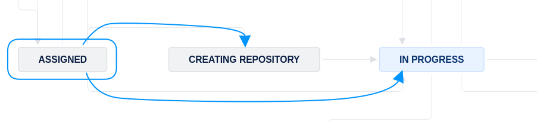
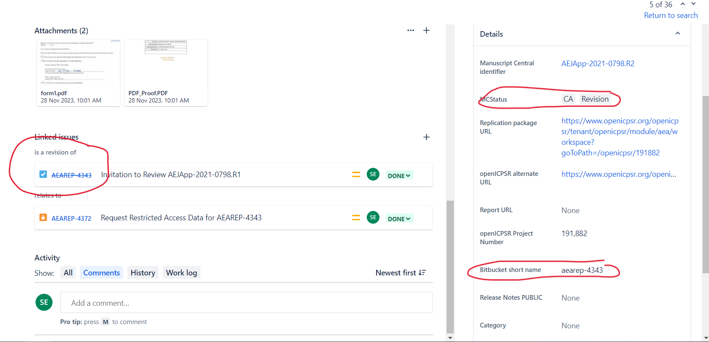

# Assigned  

When you are first assigned an issue, it will in the `Assigned` status. The first thing you must do is to either create a new repository (`Create repository`) , or reference an existing repository (if the issue is a [revision](aea-revision-reports-after-author-resubmission)) in order to move to `In Progress`.

- This lets us know that you have started working on replication.


```{note}
The link to JIRA is [https://aeadataeditors.atlassian.net/jira](https://aeadataeditors.atlassian.net/jira) (requires login).
```

## Identifying whether the issue is a revision or not

```{warning}
Is the current Jira issue an **original report** (first time we see the manuscript) or **is it a revision** (we've seen the manuscript before)?
```



#### Signs that this case is a revision



- [ ] Check the `MCStatus` field: 
  - If it says "`RR`" or "`CA`", then it is an "original report" - proceed to the next step ([`Creating repository`](create-repo)).
  - If it says "`CA` `Revision`", then it is ... a revision! 
    - Follow the instructions at "[Revision reports after author resubmission](aea-revision-reports-after-author-resubmission)".
    - In particular, **do NOT create a new repository** - you will re-use the previous repository. Enter the previous repository "stub" into the `Bitbucket short name` field.
    - In particular, **do NOT create "update" or "new" directories** The current state of the repository should always correspond to the author's structure. Overwrite files, delete files. The previous state is preserved in Git. This will also tell you what files have changed.
    - When running a second replication on the same archive, please be sure to have the committed "REPLICATION.md" be accurate when you commit it - do not let it contain holdover data from a previous replication attempt, as this can lead to confusion.
    - Once you have entered the previous repository "stub" into the `Bitbucket short name` field, you can proceed to [`In Progress`](in-progress).

```{warning}
If a field on Jira is already filled out, **do not edit it**. The only exception is if software is missing from the `Software used` field.
```