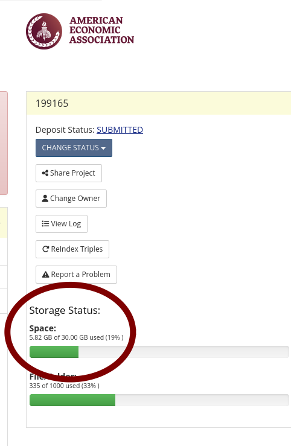
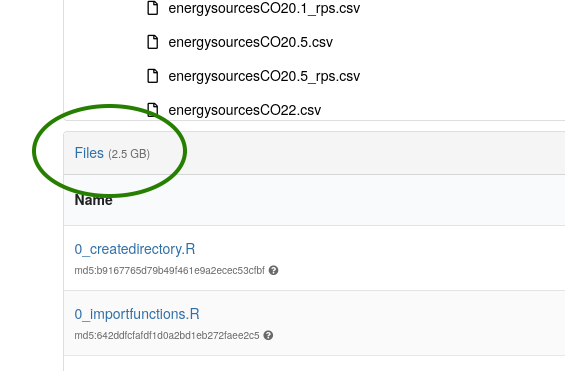
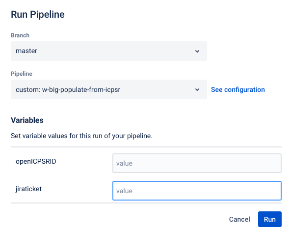
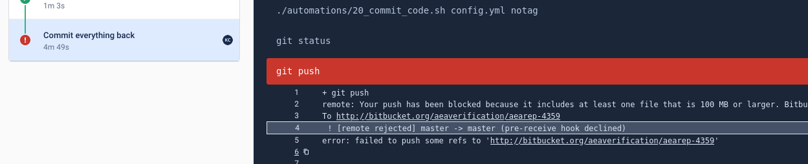
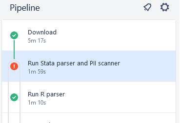

(create-repo)=
# Creating a repository and running pipeline


```{warning}
In some instances, somebody else has already created a repository. Always check first if the `Bitbucket short name` is already filled out. If yes, skip this section and go to [Collecting information](collecting-information)!
```

## Creating a repository

- [ ] start by [creating a repository using the import method](https://bitbucket.org/repo/import) 
    - copy-paste from this URL to the URL field (this is also available in the Jira dropdown "Shortcuts")

    ```bash
    https://github.com/AEADataEditor/replication-template
    ```

    - the repository name should be the name of the JIRA issue, in **lower case** (e.g., `aearep-123`)
    - Be sure that `aeaverification` is always the "owner" of the report on Bitbucket. 
    - The Project should be the abbreviation of the journal (e.g. "JEP")
    - Keep the other settings (in particular, keep this a **private** repository).
    - Click `Import Repository`
    - Keep this tab open!


- We have now created a Bitbucket repo named something like `aearep-123` that has been populated with the latest version of the LDI replication template documents!

(ingesting-author-materials)=
## Ingesting author materials

We will now ingest the authors' materials, and run a few statistics. Typically, the materials will be on a (private) openICPSR repository. Sometimes, the materials will be at Dataverse, Zenodo, or elsewhere.

- If at openICPSR, the fields `Replication package URL`, `openICPSR alternate URL`, and `openICPSR Project Number` will be filled.
- If at Zenodo or Dataverse, the `Replication package URL` will have the DOI of the replication package, `openICPSR alternate URL` and `openICPSR Project Number` will be empty.


```{note}
This currently works reliably only for openICPSR. This documentation will be updated when it works for Dataverse and Zenodo as well.
```

### Inspect the deposit

First, click on the `openICPSR alternate URL` URL (or `Replication package URL` if it contains a DOI and the other fields are empty). Inspect the deposit.

- on openICPSR, you will see the size of the deposit on the right:



- on Zenodo, you will see the size of the deposit on the left, below the "featured" file:



The information may be in different locations at other repositories. 

:::{note}
Make a note of the size of the deposit!
:::

(running-populate-icpsr)=
### Running the pipeline

You will now run what is called a *`Bitbucket Pipeline`*. Similar tools on other sites might be called `Continuous integration`, `Github Actions`, etc. If you have encountered these before, this will not be news for you, but it isn't hard even when this new.

- First, in the repository you just created, navigate to the `Pipelines` tab


- Because this is new, you will see the "Run initial pipeline" page. Click on `Run initial pipeline`.


- You will now need to select a "pipeline" to run. 


:::{note}
This is where the information about the size of the deposit matters! Choose the option that best matches the size of the deposit.
:::


:::{admonition} If the deposit is less than 3 GB...
:class: dropdown tip

- Choose "`1-populate from ICPSR`" (might change in the future), and fill in the ID for the relevant source of the replication package (here: openICPSR ID = `123456`), and hit `Run`.


:::

:::{admonition} If the deposit is more than 3 GB...
:class: dropdown tip

- Choose "`w-big populate from ICPSR`" (might change in the future), and fill in the ID for the relevant source of the replication package (here: openICPSR ID = `123456`), and hit `Run`.




Note that if you choose this pipeline, certain information is not generated (Stata scan, R package scan), and you may need to augment these manually. Try to avoid this pipeline if possible, and make a note in the Jira comments if you had to run this.

:::


### Monitoring the pipeline

- Your pipeline will start, working through various steps. This might take a while! Do the next step ([Collecting Information](collecting-information)) then come back here.


- [ ] Once your pipeline is done, check that it is green.
  - If for some reason, it fails, the logs are available for your supervisor to inspect, and to help you. Check out the possible fixes below. You, or the person assigned to `Part B`, may then need to do [the manual steps later](Manual1).


### Possible errors for pipeline failure

#### Files too big

Bitbucket might complain in the `Commit everything back` step that

> remote: Your push has been blocked because it includes at least one file that is 100 MB or larger.



**Solution**

Investigate which files are being captured that are too big. The list of file endings that Git should ignore is kept in the [`.gitignore` file](https://github.com/AEADataEditor/replication-template/blob/master/.gitignore). Once you have figured out which files are causing the problem, you should exclude them:

- in your repository, by adding them into the repository-specific `.gitignore`
- in the [template `.gitignore` file](https://github.com/AEADataEditor/replication-template/blob/master/.gitignore), by suggesting an edit. Click on [this link](https://github.com/AEADataEditor/replication-template/blob/master/.gitignore), then choose "`Edit`", and add the extension to the file (you will need a Github account to create a pull request).

#### Memory or CPU usage to high



If your pipeline fails in the Stata step, click on the failed step, and scroll to the error message. If you see this:

```
./automations/10_run_stata_scanner.sh: line 64:   122 Killed                  stata-mp -b do ../PII_stata_scan.do
```

It is likely that the PII scan failed because the in-memory dataset is too large (too much memory was run, and the pipeline was killed). Try running the pipeline again with the "`w-big populate from ICPSR`" (see above).

## Next step


