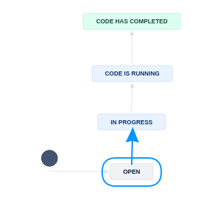

(prepare-to-run-code)=
# Preparing to Run Code (Part B)


## Signal that you are working on Part B

To signal that you are starting to run the code, you will now transition the JIRA subtask to "`In Progress`".



```{admonition} If you are the replicator who was previously assigned Part A
:class: dropdown
In this case, your working area is already prepared, and you can skip to [Get the data](get-the-data).

```

(Manual1)=
## Prepare your working area

Before we can verify code, data, and documentation, we need to  first get the code, then the data into your "working area". Let's start with the **code**.

```{note}
You now need to decide on what computer you are going to do the data analysis - that should be the place you do the next few steps. See [Access Computer](Access_to_computers) for details.
This is because the git setup we use does not allow you to include the data files in the Bitbucket repository, so when you download the replication package from openICPSR or elsewhere, they do not get added to the Bitbucket repository.
```


(get-the-code)=
## Get the code via the existing Bitbucket repository

::::{tab-set}

:::{tab-item} CCSS 


- [ ] Access the CCSS environment: [shortcut to Cloud](https://client.wvd.microsoft.com/arm/webclient/v2/index.html), for other access, see [Appendix](windows-remote).
- [ ] Ensure that you have set up your CCSS environment (see [appendix](setup-bash))
- [ ] **Get the code:** Clone the Bitbucket repository onto the CCSS server you are working on
  ```
  git clone https://yourname@bitbucket.org/aeaverification/aearep-xxx.git
  ```
- [ ] Alternatively: If you have done the full [Bash setup](setup-bash), you can run
  ```bash
  aeagit xxx
  ```

:::


:::{tab-item} BioHPC

All actions on BioHPC will be performed in a terminal. Depending on whether you connect with SSH, VNC, or Visual Studio Code, details may differ (see [Access Computer](Access_to_computers) for details). We suggest connecting via SSH or using Visual Studio Code (which uses SSH in the background), for simplicity. It is assumed that you have done [Bash setup](setup-bash). 

- [ ] If using SSH, you are already at the "terminal". If using VNC, choose `Terminal` from the application menu. 
  - If using [Visual Studio Code to connect to BioHPC](linux-vscode), follow instructions from the **Github Codespaces** tab!
- [ ] Change directory to the common workarea:
    ```bash
    cd /home2/ecco_lv39/Workspace
    ```
- [ ] Populate BioHPC with the Bitbucket repo
  - Use the LDI short-cut command 
    ```bash
    aeagit 123 http
    ```
    to clone the Bitbucket repository for `aearep-123` onto BioHPC (this executed `git clone (URL)/aearep-123` behind the scenes).
    - If this is the first repository you run this, you may need to configure authentication. Follow the instructions from the `aeagit` command.
    - Once the  `aeagit 123 ` has completed, it show a bunch of error messages (maybe), and a command `cd aearep-123`. Copy and paste that command, entering the directory where you just cloned the repo. **All subsequent actions should be done in that window.**

:::

:::{tab-item} Github Codespaces (CS) 

All actions in Github Codespaces (CS for short) will be performed in Visual Studio Code (VSC): the left pane for file and Git actions, in the Terminal, or in the text editor. To connect to CS, see [instructions to come]. It is assumed that you will run this from your laptop, but it can be run from any internet-connected computer. The particular template you use for CS already has the  [Bash setup](setup-bash) done for you. However, you need to have followed the [CS setup instructions](computing-using-cs).

- [ ] Access [Github Codespaces](https://github.com/codespaces), see [appendix](computing-using-cs) for more details.
- [ ] Use the Terminal built into VSC (`Menu` -> `Terminal` -> `New Terminal` ). By default, the Terminal should run a `bash` shell.
- [ ] Populate CS with the Bitbucket repo (yes, this is a bit weird)
  - Use the LDI short-cut command 
    ```bash
    aeagit 123 http
    ```
    to clone the Bitbucket repository for `aearep-123` onto CS (this executed `git clone (URL)/aearep-123` behind the scenes).
    - If this is the first repository you run on this CS instance, you may need to configure authentication. Follow the instructions from the `aeagit` command.
    - Once the  `aeagit 123 ` has completed, it will open a new VSC windows. **All subsequent actions should be done in that window.**
:::

::::

## Verify that the code is present

With the first step, you obtained a copy of the Bitbucket repository. You should now have a folder called `aearep-123` (or whatever the repository number is). All subsequent steps should be done from there.

```{important}
If you do not see a folder like `123456` or `dropbox-xyz` in the repository, then the Bitbucket Pipeline likely did not work. You will then need to populate the code (and data) manually. You will do this AFTER downloading the data, in the next step.
```

(partb-verify)=
## Verify that you can actually run the code

Before you spend time obtaining the data, now is a good time to assess (again) if you have everything needed to run the code.

Have a look at the **README** again. 

- [ ] Is there information about **Requirements**? 
  - Is there information about the **software**? 
  - How long does the author say the code will run? Is it a reasonable time, or do we maybe need to run it on a more powerful computer?
  - How much memory, or processors, does the code need? Again, is the computer you intended to choose sufficient, or do we need to get access to a more powerful computer, or even a cluster of computers?
  - What operating system (Mac, Windows, Linux) does the author appear to have used?

Now fill out the **Stated Requirements** section of **Part B** of the report.

- Check if the deposit has a 'main' or 'master' file and fill out the 'MainFile' field in Jira under the 'Repl. info' tab. 
- Mark the **operating system (OS)** that the authors used in the field `Original OS`. Leave blank if you do not know.


:::{admonition} Be sure to use the `REPLICATION-PartB.md` for this section!
:class: dropdown

As part of the [automated processing](running-populate-icpsr), the `REPLICATION.md` is split into two parts, `REPLICATION-PartA.md` and `REPLICATION-PartB.md`. Somebody else may be working on Part A at the same time as you are working on Part B. Please be sure to use the correct file for your work.

:::

## Prepare the code-check

Now is a good time to understand the code in a bit more detail:

- [ ] In the template, you will find *[code-check.xlsx](https://github.com/AEADataEditor/replication-template/blob/master/code-check.xlsx)*. 
  - Use this to create a list of all Tables and Figures in the paper
  - You will use this to guide later to tabulate your findings!
- [ ] Fill out the "**Code Description**" section of the `REPLICATION-PartB.md`
  - Provide some information about the program files (are there 3 Stata files? Are there 5 Matlab programs?). You will use this information to fill out the `Software Used` (in the main task) later as well, but provide details here.
    - You can use the file "`generated/programs-list.txt` to help you here.
  - Did you have difficulty aligning the README with the files? Does the sequence suggested by the programs differ from what's written in the README? 
  - Are there files in the archive not explained in the README?
  - Copy-and-paste the *code-check.xlsx* into the code description part, listing the programs. Omit the "Reproduced?" Column in doing so. Use the [Excel-to-Markdown plugin](https://marketplace.visualstudio.com/items?itemName=csholmq.excel-to-markdown-table) for VSCode. 
    - This table will be pasted in under "Findings" again, with "Reproduced?" column, once code has been run.

## Verify that you can actually run the code

```{admonition} Do you think you know how to run the code in the software mentioned?

You may not have the right experience, talk to your supervisor!

If both of you agree that **nobody** will run the code, then

- Move the **subtask** to "Part B is complete" via `No code was run`
- Go straight to [Part C](partc), writing the **Findings** section

```


(describe-the-data-files)=
## Describe the provided data

The automated scripts should have filled out the "**All data files provided**" section, but if not, please do so here. 


If the list is VERY long, put it into an appendix, but make a note in this section that there is an appendix with this info.


```{admonition} What if there are no data provided at all? 

If **there are no data at all**, for instance, when data are confidential and only available through some computer system at the Census Bureau or in Sweden?

Then you will skip getting the data and running code, and you are done with **Part B**! 

- Move the **subtask** to "Part B is complete" via `No code was run`
- Go straight to [Part C](partc), writing the **Findings** section

```

If there is ANY data at all present, then continue to [get the data](get-the-data).


(get-the-data)=
## Get the Data 

If you think that you are ready to run the code, you need to get the data. 
When getting the data, please take care to distinguish

- data that is part of the openICPSR deposit
- data that the README tells you to download or otherwise access
- data that you are provided on the L-Drive, which is typically provided under an agreement with the authors, and cannot be redistributed.


Here, we will describe the most likely first step: getting the data from openICPSR. Any data you download should also be stored on this computer. We do not explicitly describe this here. **CCSS** is the most likely place where you do this, but double-check with your supervisor.


```{admonition} What if the data are not on openICPSR?
:class: dropdown

Sometimes, data are provided on other repositories: OSF, Dataverse, Zenodo are the most frequent ones.

You may need to adapt the process below to those circumstances. See the following mapping:

| Deposit | Name of download folder | Name of script | Tested? |
|---------|-------------------------|----------------|---------|
| openICPSR | `111234`  | `tools/download_openicpsr-private.py` |  Yes |
| OSF       | `osf-ZX123A` | `tools/download_osf.sh`  | Partially |
| Zenodo    | `zenodo-1234567` | `tools/download_zenodo.sh` | Maybe |
| Dataverse | `dv-2YWLWG` | `tools/download_dv.py` | Maybe |

In all cases, you should obtain the data from the deposit, and otherwise follow the same principles as are described below for openICPSR.

```

::::{tab-set}

:::{tab-item} CCSS

- [ ] Access the CCSS environment: [shortcut to Cloud](https://client.wvd.microsoft.com/arm/webclient/v2/index.html), for other access, see [Appendix](windows-remote).
- [ ] In some cases, you may be asked to use (restricted) data on the S: drive or L: drive. Follow instructions as you receive them.
- [ ] Download the openICPSR data (if available). 
  - Try to do this first using scripts. See [the details in the appendix](using-pre-pub-openicpsr). 
    ```bash
    python tools/download_openicpsr-private.py 111234 
    ```
    ```bash
    unzip -n 111234 -d 111234
    ```
    which should unpack the data files only, not overwriting anything else. **If this fails, do the "Manual steps."** 
- [ ] attempt to download data from various sources indicated by the authors, but ONLY if no sign-up/ application process is involved. 

:::

:::{tab-item} BioHPC

- [ ] Download the project from openICPSR, using the script. See [the details in the appendix](using-pre-pub-openicpsr):
    ```bash
    python3 tools/download_openicpsr-private.py 111234 
    ```
  - The downloaded ZIP file (`111234.zip`) needs to be unzipped (the terminal output will tell you):
    ```bash
    unzip -n 111234 -d 111234
    ```
- [ ] Upload data that you obtained from other sources to CS. This is an advanced activity not described here.

:::

:::{tab-item} Github Codespaces (CS)  

- [ ] Access [Github Codespaces](https://github.com/codespaces), see [appendix](computing-using-cs) for more details.
- [ ] Use the Terminal built into VSC (`Menu` -> `Terminal` -> `New Terminal` ). By default, the Terminal should run a `bash` shell.
- [ ] Be sure you still have the Bitbucket repository clone, if not, follow instructions under [Code](get-the-code) again.
- [ ] Download the openICPSR deposit using the LDI short-cut command.  See [the details in the appendix](using-pre-pub-openicpsr). 
    ```bash
    python3 tools/download_openicpsr-private.py 111234 
    ```
    If this fails, do the "Manual steps."
  - The downloaded ZIP file (`111234.zip`) needs to be unzipped (the terminal output will tell you):
    ```bash
    unzip -n 111234 -d 111234
    ```
- [ ] Upload data that you obtained from other sources to CS. There are two ways to do this:
    - Drag-and-drop the downloaded data file into the file pane of VSC, into the appropriate location.
    - Use the `gh` command line tool from a non-VSC terminal (on your local computer): 
      ```bash
      gh cs cp datafile.dat remote:/workspaces/aearep-123/111234/data/location
      ``` 
      (adjust accordingly as per the author's instructions)

:::


:::{tab-item} Manual steps 

If the automated population of the author's code directory did not work, you will need to manually download the replication package. Try to do this first using scripts.

**Downloading using scripts**

See [the details in the appendix](using-pre-pub-openicpsr). You can do this on CCSS, BioHPC, or on Github CS. 

**Downloading using a browser**

If you are still unsuccesful at this point, try this manual method (typically, on CCSS)

- [ ] Download the code (and data) from openICPSR (typically for most cases). See [details in the appendix](using-pre-pub-openicpsr) for instructions on downloading these materials. Typically called `111234.zip`.
  
  - Copy/paste the downloaded openICPSR ZIP file into the local copy of the `aearep-123` repository
    - The ZIP file should be called something like `111234.zip`. Note: it might *look* like a folder, but it is not! (on Windows) 
    - The ZIP file will be wherever your browser downloads materials - probably your `Download` folder.

**Next manual steps**

The local repository should now have the relevant LDI replication template materials and the openICPSR ZIP file containing the replication materials provided by the authors.

- [ ] If uploading to CS, copy the downloaded ZIP file into the CS. There are two ways to do this:
  - Drag-and-drop the downloaded openICPSR ZIP file into the file pane of VSC. 
  - Use the `gh` command line tool from a non-VSC terminal (on your local computer): 
    ```bash
    gh cs cp 111234.zip remote:/workspaces/aearep-123
    ``` 
    (adjust accordingly)
- [ ] Unzip the openICPSR folder under a folder **named for the openICPSR repostory number**. 
  - From bash: 
    ```bash
    unzip -n 111234.zip -d 111234
    ```
  - On Windows, right-click and select "Extract all". When asked, do not overwrite files.
  - On OSX, double-click. When asked, do not overwrite files.
  - The individual files that are part of the replication package should now be in a subdirectory (e.g, `111234`, the openICPSR repository number). 
  - Perform a `git add`: `git add 111234` should do the right thing.

  ```{warning}
  Do not try to `git add -f`! Unexpected (typically **bad**) things will happen.
  ```

:::

::::

## Did the Bitbucket Pipeline scripts work?

In cases where the package downloaded from openICPSR is too big, or where the data do not come from openICPSR, the automated **Bitbucket Pipeline** scripts will not work. In this case, you will need to run some additional steps to run the automated scripts. **This is best done on BioHPC or CS**.

::::{tab-set}

:::{tab-item} The Pipeline worked!

You don't have to do anything additional, you can move on.

:::

:::{tab-item} Running  on CCSS

Running the automated steps on CCSS has not been fully tested yet.

:::

:::{tab-item} Running on BioHPC

- [ ] Access BioHPC, see [Access Computer](Access_to_computers) for details.
- [ ] Change directory to the place where you downloaded the repository and the data
      ```bash
      cd /home2/ecco_lv39/Workspace/aearep-123
      ```
- [ ] Then run the ingest scripts:
    ```bash
    export PATH=$PATH:/usr/local/stata16/
    ./tools/pipeline-steps1-4.sh 123456
    git push
    ```
:::

:::{tab-item} Running on Github Codespaces (CS)

- [ ] Change directory to the place where you downloaded the repository and the data, typically 
      ```bash
      cd /workspaces/aearep-123
      ```
- [ ] Then run the ingest scripts:
    ```bash
    ./tools/pipeline-steps1-4.sh 123456
    git push
    ```
:::

::::

## Ready!

You are now ready to run code. 
