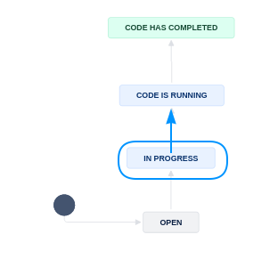

(running-code-partb)=
# Running Code (Part B)

In this stage, you will run the code, by using the provided data. The `REPLICATION.md`  is the report!


## Signal that you are working on Part B

To signal that you are starting to run the code, you will now transition the JIRA subtask to "`Code is running`".




## Principles

Keep a log of what you do, what you find, and what does not work, in the `REPLICATION.md`, under *Replication Steps*.

- Document if you manually downloaded data from anywhere other than the authors' deposit.
- Document any manual changes you made to the deposit structure (renamed file, created directory).
- If you run into error messages that are not captured by the "log file" (see below), then screenshot, or copy verbatim, into the report.

You should also run code so that it generates an actual "log file". How to do this depends on the software. 

:::{admonition} We have an [entire section of the manual](running-code-general) for this!

Check the software-specific guidelines in the manual's [section on running code](running-code-general), debug the code, and set the code to run.
:::

:::{note}

Sometimes, code can run for a long time. Leave the Jira ticket in `Code is running` to signal that there is activity there. Remember to come back regularly to check on it, and remember to commit all changes immediately (before running code).
:::

Once you have run the code, come back here to continue!

## Details

- If code runs for a long time, record in the Jira issue (as a comment) when you started the code. 
- Use the `Computing Environment` to record where (CCSS, BioHPC node, etc.) you started the code.
- It is not unusual for code to run for several days. You can start a new case in the meantime!

## Wrapping up

Once the code has run, **error-free and creating the intended output** (as far as you can tell), it is time to wrap up this sub-tasks.

- Review again the **Replication steps** section, please include all steps that you took.

```{note}
You, or somebody else, will compare the output to the manuscript in the next step! You may, however, simply check that output exists, regardless of its specific content, before moving forward.
```

