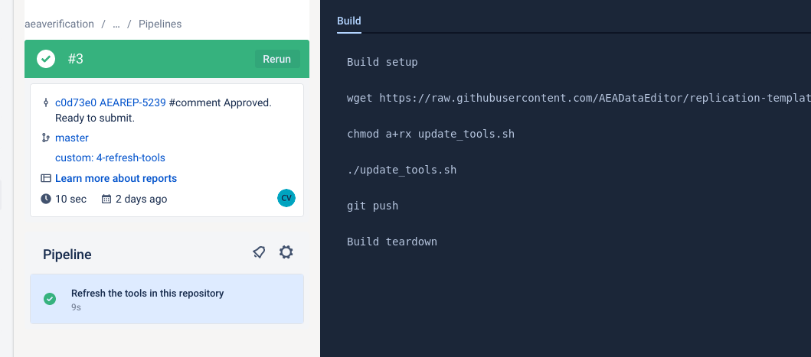
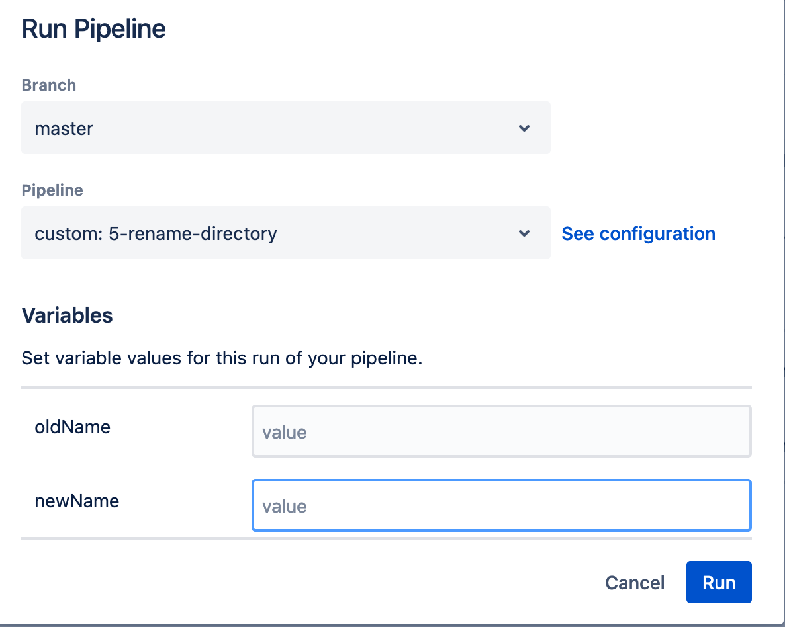

(aea-revision-reports-after-author-resubmission)=
# AEA: Revision reports after author resubmission

Some pre-publication reproducibility checks require revisions from the authors. We will try to assign these revisions to the replicator for the original submission whenever possible.

## Generic Guidance 

- Most revisions will not take you much time, so please try to process them quickly!
- Revisions do not require you to repeat all of the same steps as the original replication (see below).

:::{admonition}  **Do not create a new Bitbucket repo**. 
You will overwrite the original repo. The original contents will still be available -- this is why we use version control software like Bitbucket!

:::

- The original REPLICATION.md is a contract; if the authors fix what we ask them to fix, then they have completed their part of the agreement.
    - If new issues turn up as a result of additional materials provided, these are okay to include as [REQUIRED] changes in the revised report. 
    - If you are unsure about something, add it to the report. While reviewing your report, we can make a determination about whether or not it can be done after acceptance of the manuscript, be a suggested instead of required change, etc. 

- In particular, **do NOT create "update" or "new" directories** The current state of the repository should always correspond to the author's structure. Overwrite files, delete files. The previous state is preserved in Git. This will also tell you what files have changed.
- Please be sure to have the committed "REPLICATION.md" be accurate when you commit it - do not let it contain holdover data from a previous replication attempt, as this can lead to confusion.


## Revision Workflow 

You should proceed through the [workflow](aea-jira-workflow-a-guide) as you would for an original case with some exceptions:

- You **should not** create a new Bitbucket repository. 
- You _may_ not need to re-run any code.  
- All sections are potentially subject to updates, so pay attention.

### In Progress 

First, advance the ticket from `Assigned` to `In Progress`. 

- [ ] Identify previous issue. 
    - You should see the previous issue listed under **Linked Issues** on JIRA. 
    - Use the previous issue, to fill in the following JIRA fields (if not already filled): 
        - `Replication package URL` 
        - `Journal` 
        - `Empirical Article`
        - `Bitbucket short name`. This should be the name of the original JIRA issue (e.g. `aearep-123)`.
        - `openICPSR project number`

(updating-repository-pipeline)=
### Updating pipeline code


First, you will want to update the tools in this repository. Navigate to the `Pipelines` tab


If you do not see pipelines run in the past, you will need to [do this manually later](revision-code-step).

- You will now need to select a "pipeline" to run. 


- Choose "`refresh-tools`". Hit "Run".


- Your pipeline will start, working through various steps, usually quite quickly.

- [ ] Once your pipeline is done, check that it is green.




:::{note}

If for some reason, it fails, the logs are available for your supervisor to inspect, and to help you. You may then need to [do this manually later](revision-code-step).

:::

It will update the code in place. You don't have to do anything except wait! Once that is done, go to the next step.


### Updating Bitbucket repository with latest code and documents

::::{admonition} If the authors have submitted a DIFFERENT openICPSR deposit...
:class: warning dropdown

... then you will need to rename the directory containing the author code in the repository. 
This is conveniently done using the `5-rename-directory` pipeline:



where the fields should be straightforward to fill in.


If for some reason you cannot run the pipeline, you will need to do this manually. `git mv` the directory containing the old deposit code to the new deposit code. E.g.

```bash
git mv 12345 67890
```

::::

:::::{tab-set}

::::{tab-item} Bitbucket Pipeline

Next, run the next pipeline. This should be the same one that is described in [Ingesting Author Materials](running-populate-icpsr). 


::::

::::{tab-item} Manually

If you can't use the Bitbucket pipeline, defer this step to [later](revision-code-step).

::::

:::::

### Prepare the working area 

Similar to the original workflow, you will need to decide where you will run code and do other manipulations. If you are the original replicator, and this is YOUR revision, this will be the **same** computer where you originally did the verification. If not, refer to the [general guidance](Manual1) on how to choose and set up your working area.

```{admonition} Please note:

If you are **returning** to the previous working area, be sure to run `git pull` in the working area before doing anything else!


```

### Updating other materials


- [ ] Download the materials attached to the JIRA issue. This will typically include 
  - an updated copy of the manuscript, 
  - a response to the editor addressing the requested changes from the prior replication attempt. 


:::{warning}

Occassionally, the email received from Manuscript Central will strip out the manuscript because it is too big. You will notice this because

- There will be no `PDF_Proof.pdf` attached!
- There is text that "the application was unable to attach manuscript files to this email, because one or more of the files exceeded the allowable attachment size (6MB). **

In this case, immediately contact the (assistant) Data Editor to obtain the correct manuscript! Do not use any other manuscript or working paper you might find online.

:::
  
- [ ] Remove obsolete files. In the root, this should be obvious (old manuscript).

- [ ] Add these to the root of the repository locally, and then `git add`, `git commit`, and `git push` them to the Bitbucket repository (e.g., `git add PDF_Proof.pdf readme.pdf reply_to_editor.pdf`)
  - The root of the repository should contain only our files (i.e., REPLICATION.md, etc.) and the manuscript files (main manuscript, any online appendices and README files provided through the JIRA ticket). Example:

```
code-check.xlsx
config.do
PDF_Proof.PDF
PII_stata_scan.do
readme.pdf
REPLICATION.md
reply_to_editor.pdf
```
  

- [ ] Open `REPLICATION.md` to review the requested changes from the prior replication attempt. Read the reply to the editor, if provided, to get a sense of what changes the authors made. Make a determination if the revision requires re-running code. 
    - If there were [REQUIRED] changes in the Code Description, Replication Steps, or Findings sections of the original report, you will likely have to re-run code. 
    - If the only [REQUIRED] changes were data citations or changes to the README, you should not need to re-run code. 


### Data 

- [ ] Update the Data Description section of the report.  

- [ ] Update the Data Checks section of the report, if new data have been provided.
  - Check the `generated` directory for any update summary, most of the mechanical checks will be automatically added to the appendix.

- [ ] Fill out the required JIRA fields: 
    - `Working location of the data` or
    - `Reason for non-accessibility` 
    - and `Data Provenance` 


(revision-code-step)=
### Code 


::::{tab-set}


:::{tab-item} Bitbucket Pipeline

If you already ran the Bitbucket pipeline, your code is already updated.

:::

:::{tab-item} Manually updating code


- [ ] Download the updated openICPSR deposit and commit the materials to the **same Bitbucket repo as the original replication**, in the **same directory** (i.e., if the openICPSR deposit is `12345` then all updated materials will again go into the `12345` subdirectory. 
    - Example: if AEAREP-250 is a revision of AEAREP-123, then download the entire openICPSR deposit and commit it to the `aearep-123` repo on Bitbucket.
    - Overwrite any files, if requested. Pay attention to files that might have been deleted (you will have to `git rm` them). 
    - There are tricks to letting Git do much of the work: **Follow the detailed instructions for the process of updating the replication materials** in the [Appendix: Updating Replication Materials after Revision](updating-replication-materials-after-revisions).

:::


::::

   
- [ ] Update the Code Description section of the report. 


### Code Review or Verification 


#### Re-running code 

- You **do not** need to re-verify tables/figures that were successfully replicated the first time *unless* the new code also affects them. 
- If parts of the code take a long time to run and the [REQUIRED] changes do not involve those parts, you do not need to re-run that part of the code. 
- **Be careful!** Sometimes the code will produce intermediate outputs along the way that may be needed later on. So if you skip parts of the code and cannot replicate the result(s), go back and check to see if you actually need to run all of the code.

- [ ] Run relevant parts of code, including the config.do generating system. 

- [ ] Update the Replication Steps section of the report, accordingly. 

- [ ] Update the `code-check.xlsx` file. 

- [ ] Update the Findings section of the report. 

- [ ] `git add`, `git commit`, and `git push` any new results to the Bitbucket repository. 

> Change the status from `In Progress` to `Writing Report`. 

### Writing Report 

In this stage, you will finalize the revision report. 

- [ ] Ensure all `[REQUIRED]` and `[SUGGESTED]` items from the original report have been changed to `[We REQUESTED]` and `[We SUGGESTED]` in the body of the report. 
    - The resolution (or lack thereof) should be included as a bullet point directly below the request. 
    - If using the scripts, you can use the [`aearevision`](https://github.com/AEADataEditor/editor-scripts) to change all the tags
    - If the resolution is incomplete (`Not done`  or `Partially done`), then repeat the usual `> [REQUIRED]` tag, as this will become an action item.

- [ ] Ensure any new issues found are tagged with the appropriate `> [REQUIRED]` and `> [SUGGESTED]` tags. 

- [ ] Delete/modify any comments of the report template that are no longer true:
    - e.g. if the previous report stated "Data not cited" and the author has now added citations, then that part should state "Data is cited" or "Data is now cited".

- [ ] Delete any parts of the report template that are no longer relevant:
    - e.g. if no code changes were `[REQUIRED]`, then delete the sections involving code, replication steps, and findings. 
    - careful however here, too: authors should only be making changes to parts that we requested changes for, but if they change things elsewhere, then you should, in fact, retain that section, and accurately describe it again. New errors *can* be introduced!

- [ ] Update the Classification. 
    - If you do not need to re-run code for the revision, keep the original classification.
    - If you do need to re-run code for the revision, update the classification appropriately.


- [ ] Incorporate all old/new requested changes and resolutions in the SUMMARY section of the report: 

    - Create a new sub-section `### Previously` and collect the **Unresolved**, and **Resolved** issues. 
      - Leave the existing `### Action Items (manuscript)` and `### Action Items (openICPSR)` sections!
    - Collect all the `> [We REQUESTED]` and `> [We SUGGESTED]` items from the rest of the report (this should correspond to the previous - [REQUIRED]` and `- [SUGGESTED]` items)
      - These should go under the `### Previously` section, appropriately classified into `Unresolved` and `Resolved`.
      - Do not create **separate** `Previously` sections for Manuscript and openICPSR sections!
      - Below each item, include the same resolution you listed in the body of the report. 
    - New and any unresolved issues should be collected with their `- [REQUIRED]` and `- [SUGGESTED]` tags under the appropriate `### Action Items` sections. 
      - If using the scripts, you can use the [`aeareq`](https://github.com/AEADataEditor/editor-scripts) as usual.
    

#### Some notes

Please be clear when writing the revision report. The report should make sense without having to refer to the previous report. 

- The body of the report should reflect the current status of the deposit. 
    - Example: if authors were missing a setup program before and now provide it, the `Code Description` section of the REPLICATION.md should be updated to reflect the inclusion of this program. 
- Replace all [REQUIRED] and [SUGGESTED] items with [We REQUESTED] and [We SUGGESTED], respectively. 
    - Note: in the summary, these tags are using bullets (`- [REQUIRED]`) - those should be changed to "quotes": `> [We REQUESTED]`
- Below each such tag, add a bullet point. Start the paragraph with "Done" if the issue was resolved, or "Not done" if not. Then explain what was done. 

An example: 

    > [REQUIRED] Please add a setup program that installs all packages as noted above. 
      Please specify all necessary commands. An example of a setup file can be found at 
      https://github.com/gslab-econ/template/blob/master/config/config_stata.do

becomes 

    > [We REQUESTED] Please add a setup program that installs all packages as noted above. 
    Please specify all necessary commands. An example of a setup file can be found at 
    https://github.com/gslab-econ/template/blob/master/config/config_stata.do

    - Done. A setup program has been added to the deposit, which installs all necessary 
    packages. 

 
## An example

In the example below, the revision found bugs in the code that were not previously present (a **new action item**), and identified the continued lack of data citations (an **unresolved** action item). A setup program that was requested was provided by the authors, and is thus **resolved**.

```
SUMMARY
-------

### Action Items (openICPSR)

- [REQUIRED] Please provide debugged code, addressing the issues identified in 
  this report.
- [REQUIRED] Please add data citations to the article. 
  Guidance on how to cite data is provided in the 
  [AEA Sample References](https://www.aeaweb.org/journals/policies/sample-references) 
  and in [additional guidance](https://social-science-data-editors.github.io/guidance/addtl-data-citation-guidance.html#confidential-databases).

### Previously

#### Unresolved 

> [We REQUESTED] Please add data citations to the article. 
  Guidance on how to cite data is provided in the 
  [AEA Sample References](https://www.aeaweb.org/journals/policies/sample-references) 
  and in [additional guidance](https://social-science-data-editors.github.io/guidance/addtl-data-citation-guidance.html#confidential-databases).

- Not done. Please add data citations to the manuscript for the 
  following data sources: data source 1, data source 2. 

#### Resolved 

> [We REQUESTED] Please add a setup program that installs all 
  packages as noted above. Please specify all necessary commands. 
  An example of a setup file can be found at 
  [https://github.com/gslab-econ/template/blob/master/config/config_stata.do](https://github.com/gslab-econ/template/blob/master/config/config_stata.do)

- Done. A setup program has been added to the deposit, which 
  installs all necessary packages.
```


Finally, don't forget to `git add`, `git commit`, and `git push` the new report. Then, change the status in JIRA from `Writing Report` to `Report Under Review`.  


## Publication

Once all review rounds have been completed, the last revision will lead to a recommendation of "Accepted". The Data Editor's staff prepares the openICPSR deposit for final publication. In general, this means that a note is added to the "Project Communications Log" on openICPSR, denoting the acceptance of the deposit. The AEA publication staff can subsequently move this issue forward to "Published" when the supplement has been published on openICPSR.

- The field `openICPSRDOI` is pre-filled, but should be checked by the AEA publication staff.

See [Preparing for publication](https://labordynamicsinstitute.github.io/replicability-training-curriculum/aea-interfacing-with-the-journal-management-system.html) for details.
