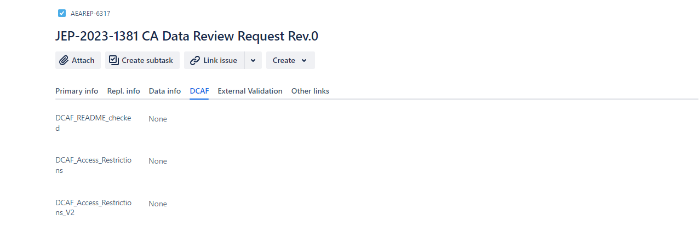
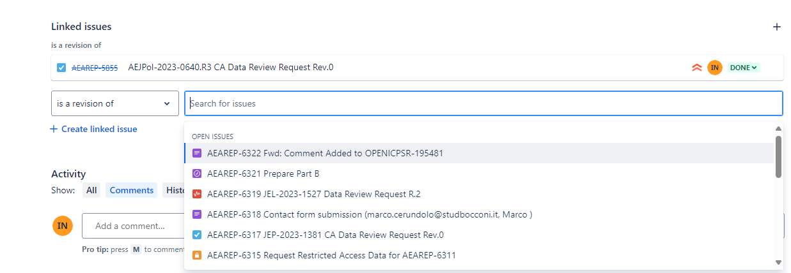
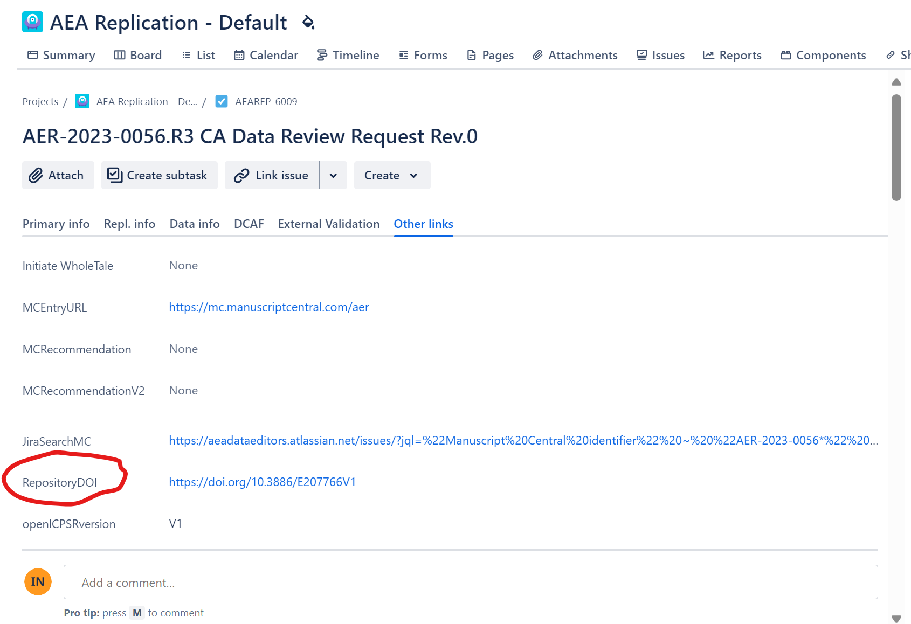

# Checking Unassigned Jira Tickets

## Setup

```{admonition} **Permissions**...
:class: dropdown

- [ ] Assigner needs password to ScholarOne (**Data Editor** shares via [LastPass](https://it.cornell.edu/faculty-password-mgmt-staff-students/sign-cornell-lastpass-account))
   - Then you'll need to install the web browser extension for whichever browser you use ([Chrome](https://chrome.google.com/webstore/detail/lastpass-free-password-ma/hdokiejnpimakedhajhdlcegeplioahd), [Firefox](https://addons.mozilla.org/en-US/firefox/addon/lastpass-password-manager/), etc).
- [ ] Assigner need permissions on openICPSR (Data Editor or **Assistant** requests from openICPSR)
```


## Basic Instructions

- Go the unassigned filter in Jira 
  - Easy way: [click on this link](https://aeadataeditors.atlassian.net/issues/?filter=10007)
  - Longer way: `Dashboards` > `Admin Dashboard` > `AEA tasks by Assignee` section > scroll down to "Unassigned".
- Click on the `Key` for a case to start the process.
- The Jira issue should have two documents attached:
    - The manuscript ("PDF_Proof.PDF")
    - The DCAF (should never be missing...)

```{admonition} If the manuscript is missing...
:class: dropdown

- Make a note of the `Manuscript Central Identifier` (copy it to your clipboard).
- Click on the `Other links` tab
- Click on the `MCEntryURL` link
- Enter the ScholarOne/Manuscript Central login details provided to you.
- Click "Review". Ctrl+F/Command-F and search for the Manuscript Number.
- Once you find the manuscript, go to the Action section, "View Proof", download the PDF of the manuscript.


- Attach the PDF to the Jira ticket.

``` 

```{admonition} If the 'MC Status' field is RR ("Invitation to Rreview")...
:class: dropdown

- Go to the MCEntryURL field in the ""Other Links" section
- Log in to ScholarOne and click Review.


- Navigate to the link that says "Invitations"


- Ctrl+F for the manuscrip number.
- Click "Agreed and begin review"
- Then close out the tab.

```


- Open up the DCAF (you can do this within Jira, without downloading).

In the most recent cases, fill out the following info from the DCAF attached:

- Fill out the `openICPSR Project Number` - this should be JUST the pure number part, not `openicpsr-123456`!
- If a different DOI is there (does not include `10.3886`), then copy the full DOI into the field `Replication package URL`!
- Review the part with "Is any of the data used in this manuscript....". This will be encoded in the field `DCAF_Access_Restrictions_V2` (which is on the `DCAF` tab in Jira)




- if `Yes, data can be made available privately` is checked:
  - Create a subtask of type `Request additional data`, with subject `Request Restricted Access Data for (AEAREP-NUMBER)`
  - 
  - Tag the Assistant Data Editor in the newly created subtask comment.
  - The Assistant Data Editor will do additional [steps](https://aeadataeditor.github.io/LDI-Research-Aide/procedures/Requesting_Restricted_Access_Data/)

Now you need to open the draft replication deposit (typically, but not always on openICPSR)

- Click on the `Replication Package URL`, which will open up a separate tab. 
- Find the README in the deposit.
- Click on the README (you can preview, probably do not need to download) and scan through to identify the software used
- Go to the tab `Repl info` and add the software identified to the  `Software Used` field.

```{admonition} If there is no README...
:class: dropdown

If there is no README, alert the Assistant Data Editor, who will create  a [short report](https://aeadataeditor.github.io/LDI-Research-Aide/procedures/Writing-Short-Report/) and send this case back to the authors.

```

## Check if case is a revision:

Check if the case is a Revision by going to the Other Links tab and clicking the JiraSearchMC. If there are other Jira issues (not subtasks or FYIs), then it is a Revision.


- Link the Revision: Go back to the main Task you were editing, click "Link issue" > "Is a Revision of" and then input the AEAREP number of the older task.



- Update the MCStatus field to include ‘Revision’ if it doesn’t already have it.
- Update the bitbucket short name with the repository name of the previous cases.
- Check if the older Jira ticket had restricted access data (i.e. Working location of restricted data was filled out). If yes:
    - Link Issue, select type "relates to" and add the aearep-xxx for the subtask "Request Restricted Access Data for AEAREP-nnn"
    - Fill out Working location of restricted datawith the same L drive path
    - Fill out Agreement Signed to match the older Jira ticket

## Non-standard unassigned cases

When you get a Jira ticket titled `"Contact form submission (researcher@university.edu, FirstName LastName)"`, often these are in reference to openICPSR deposit that have already been published. The message is from someone reviewing the deposit and found something concerning, like a missing code file or potential PII.

- Review the message in the `Primary Info Section`.
- Using the DOI or article titled provided, search for the Manuscript Identifier.
    - You can find the article titled on the manuscript attached. 
    - You can find the DOI under the "Other Links" tab.



- Fill out the `Journal` field and the `Manuscript Central Identifer` field.
- Mark the `MCStatus` as Update and fill out the `Update Type` (under Other Links) as the appropriate label, depending on who is contacting us.
- Tag the Assistant Data Editor in the ticket comments. 
- The Assistant Data Editor will contact the authors.  


