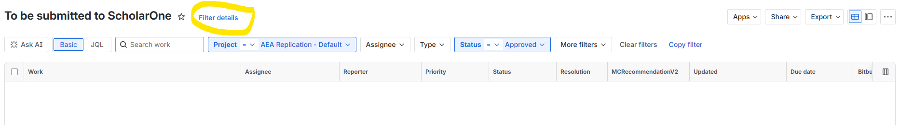

# Basic setup

In the JMS, the Data Editor is set up as a reviewer who can be assigned during the conditional accept stage. Assignment is via email to a pre-configured email address. Once the Data Editor has finalized the replication report, a manual upload is required to submit the report. If the report requires a revision, a note may need to be posted on the openICPSR deposit as well. If the report requires no revisions, a note is made on the openICPSR deposit to confirm that everything is in order.

```{note}

**Permissions**

- [ ] submitters needs password to ScholarOne (**Data Editor** shares via [LastPass](https://it.cornell.edu/faculty-password-mgmt-staff-students/sign-cornell-lastpass-account))
   - Then you'll need to install the web browser extension for whichever browser you use ([Chrome](https://chrome.google.com/webstore/detail/lastpass-free-password-ma/hdokiejnpimakedhajhdlcegeplioahd), [Firefox](https://addons.mozilla.org/en-US/firefox/addon/lastpass-password-manager/), etc).
- [ ] submitters need permissions on openICPSR (Data Editor or **Assistant** requests from openICPSR)
- [ ] submitters need `Publisher` permission on Jira (**Assistant** can  set in [Project -> Settings -> People](https://aeadataeditors.atlassian.net/plugins/servlet/project-config/AEAREP/people)   in Jira)

```

**Daily ScholarOne Subscription Reminder**

Submitters should receive a daily email reminder titled **"Subscription: To be submitted to ScholarOne"** to ensure reports are submitted on time.

1. Go to the Jira filter for reports **To be submitted to ScholarOne**:  
   [https://aeadataeditors.atlassian.net/issues/?filter=10030](https://aeadataeditors.atlassian.net/issues/?filter=10030)

3. Click **Filter details**.  
   

4. Scroll down to **Subscriptions**.  
   

5. Click **Add subscription**.

6. Set up a **Personal subscription**:  
   - Choose your own email address.  
   - Set it to run **every day**.

7. Save the subscription. You should now receive daily reminders for reports that need to be submitted to ScholarOne.

