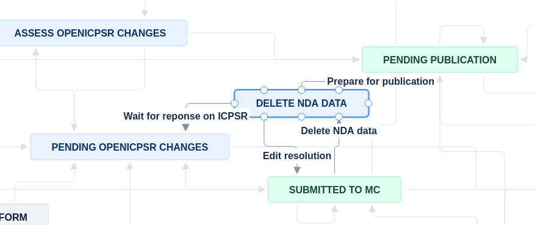

(deleting-nda-data)=
# Deleting restricted data 

## Decision point?

```{note}
If 

  - [`Agreement signed`] is empty, or it has some value, and
  - [`Was data deleted?`] is `Yes`

then you can proceed to [Submitting deposit-related information via openICPSR](submitting-info-via-openicpsr).

Otherwise, you will need to go through the "Restricted Data Deletion" process outlined on this page.

```

:::{warning}

This does not apply to `MCStatus` = `RR` or `MCRecommendationV2` = `Conditional Accept` cases. For both of these scenarios, we will see the replication package again, and will need the restricted data.

:::

:::{note}

The process of deleting data should be performed by the Research Aide.

:::

## Moving the Jira issue

You should move the Jira issue to the `Delete NDA Data` status by choosing `Deleting NDA Data`. 



## Delete the data

- [ ] CCSS-Cloud: Delete the data from the L-Drive.
- [ ] If some processing occurred on BioHPC: Confirm deletion with the RA, or delete the entire `aearep-xxxx` folder.
- [ ] Box: Follow instructions at [LDI Research Aide guide](https://aeadataeditor.github.io/LDI-Research-Aide/procedures/Requesting_Restricted_Access_Data/#once-case-is-done)

## Move the issue forward

Once the box for [`Was data deleted?`] is marked `Yes`, you can proceed to the next steps. Select `Pending openICPSR Changes`.

