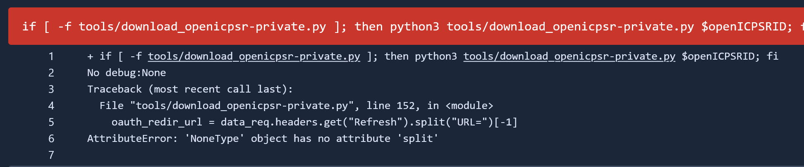

# AEA: Monitoring Pending openICPSR Changes


## Pre-requisites (JIRA)


:::{admonition} One-time administrative setup (permissions)
:class: dropdown

- [ ] assessors need to be in the `Assessor` group (**Assistant** can  set in [Project -> Settings -> People](https://aeadataeditors.atlassian.net/plugins/servlet/project-config/AEAREP/people)   in Jira)
- [ ] assessors need permissions on openICPSR (Data Editor or **Assistant** requests from openICPSR)

```

:::


## Background

Many cases which the Lab reviews receive a recommendation ([`MCRecommendationV2`] on Jira) of `Accept - with Changes.` What this means is that the changes which are requested do not constitute a complete revision from the authors. Instead of re-submitting a complete revision for review by the Lab, the authors will make any necessary changes to the deposit directly on openICPSR. Separately, any changes to the manuscript/appendix will be made at the copyediting stage by the editorial office, without further interaction with the Lab.


:::{note}

 In some cases,   the deposit may have been made at a different repository, such as Zenodo or Dataverse. Wherever you read "openICPSR" here, treat it as "wherever the deposit may be". Other repositories have other methods of inspecting files, or downloading the entire package. 
 
:::

It is important to understand how the submission process works once the final report has been approved. The RAs responsible for this process are following the instructions in [Submitting information back to the Editorial Office and to authors](aea-interfacing-with-the-journal-management-system). If you are not yourself involved in that process, please review those instructions. Briefly, cases that are designated as `Accept - with Changes` will have the reproducibility report submitted to ScholarOne (aka Manuscript Central (MC)), the Jira ticket will be moved into status `Pending openICPSR changes`, and the ICPSR deposit will have been unlocked so that the authors can make changes, with comments to that extent in the "Project Communication Log." 


The openICPSR deposit is subsequently regularly monitored. Authors may contact the Data Editor as well. When it is clear that edits have been made to the deposit, the Jira issue is moved to `Assess openICPSR changes`. The Data Editor and team then need to verify that all of the `[REQUIRED]` tags in the last submitted report have been completed. The RA conducting that check can review the required changes in the full report on Bitbucket, but may also need to consult additional communications in the Project Communication Log in openICPSR and on Jira.

The evaluation process usually does **NOT** require running any code. In most cases, these are minor changes, such as adding software dependencies or data access instructions to the README. Some cases will involve minor debugging issues, for which the Lab  only checks to see that edits to the code have been made as identified in the report. Unless specifically instructed to do so by the Data Editor, do not run code.

## Process

If you are the RA tasked with this, these are your instructions.

### Verifying if changes have been made

- A good place to start in this process is to go to the openICPSR deposit (fields [`Replication package URL`] or [`openICPSR alternate URL`]) 
- First, verify the **date** of the last request made to the author, in the "Project Communication Log" area. The Project Communication log always contains our request to the authors, and may contain subsequent responses from the author.

While checking the Communication Log, look for any uploaded response letters from the authors. If a response letter is attached there, download it and attach it to the corresponding Jira ticket, so we have a complete record in one place.

Now open the project log: click "View Log", just below "Share Project" and "Change Owner."


- Now open the project log:  click "`View Log`", just below "Share Project" and "Change Owner." 


- This log will tell you all the changes that have been made to the deposit and when. From here we can tell whether or not the authors have made any changes since we originally requested the revisions. 
- Additionally, this is a great resource for checking which program files the authors have made changes to. 

### No Changes Have Been Made

- If no changes have been made to the deposit **four weeks** after requesting revisions, start a message in the Communication log:

    - with subject line: `AEAREP-xxx Data and Code Deposit Revisions Reminder` (replace with appropriate numbers)
    - with body

```
Authors,

Please make the revisions requested to the openICPSR deposit so that we may
move forward with publication of the deposit.

See our previous comment above and our full report for details. 
Feel free to contact us directly at dataeditor@aeapubs.org with any questions.


> [NOTE] Starting July 1, 2021, we will start to publish replication 
packages as soon as all requested changes to the deposit have been made. 
Please process any requested changes as soon as possible.

Thanks!
```

- Make a note in the Jira ticket that such a message has been posted.
- If after an additional **four weeks** still no changes have been made, make a note in the Jira ticket, tagging/ alerting the Data Editor.

### If changes have been made

Once you have ascertained that changes have been made, and if this hasn't already been done, move the Jira ticket to `Assess openICPSR changes`. 


### Update the Bitbucket repository

We want to capture the latest code, and generate a listing of all the files in the openICPSR deposit. To this extent, re-run the [Ingesting Author Materials](running-populate-icpsr) steps. 

:::{note}

If for some reason, this fails (see screenshot), you may need to [update the Pipeline tools in the repository](updating-repository-pipeline), then try again.



:::

### Verify Requested Changes

You should now open the Bitbucket report, and identify the changes that the authors were expected to make. How to do this will vary. In some cases, you may be able to simply inspect the deposit, in others, you may need to download the deposit again, and verify the changes made, as you might do for a full revision (see [Revision Reports](aea-revision-reports-after-author-resubmission)).

::::{warning}

Except in extremely rare cases, do **not** re-run code.

::::

- Open the report. You can do this by checking out the Bitbucket repo, or by clicking on the [`Report URL`] field.
  - Check the "Summary" (at the top), as well as the "Reason for incomplete reproducibility" (at the bottom, and in the Jira issue)
- Copy all the items in `Action Items (open ICPSR)` (disregard the manuscript section, this is checked by the editorial office)
- Paste the Action Items into the Comments section of Jira.
- Go through each item and verify the changes by marking 'Done' or 'Incomplete' next to each item. Refer to the summary or the action item for more detail as to why this item was considered incomplete. Add any relevant details. For example:

*[REQUIRED] As specified in the Policy and the DCAF, the README shall follow the schema provided by the Social Science Data Editors'template README. **Incomplete**- They added computational requirements but are missing Statement About Rights*

  - For each change, you should make a note of what problem was addressed. For instance, if the "Reason for incomplete reproducibility" notes that the code contained fixable bugs, and the authors have made the changes noted in the report, then you will want to  uncheck the box "Bugs in code".
  - You can find the "Reasons for incomplete reproducibility" in the "Repl. info" tab in the Jira ticket, or in the popup when moving from `Assess openICPSR changes` to `Pending publication` at the end of this process.
  - Check that the deposit doesn't have any extraneous files (Manuscript PDFs, Response to the Editor PDF, files with tildes (`~_readme.doc`, ...) etc). If there are these files, note this on the Jira comment, tagging the senior members of the lab. Authors must remove these files. If in doubt, check with senior members.
  - **Check that the deposit is "Submitted" status**. 
  

::::{admonition} How do you know that the changes are sufficient?
:class: note

For instance, the last report might have said:

```
- [REQUIRED] Please provide debugged code, addressing the issues identified in this report. 
```

and the report will have contained some mention of the bugs found. Without re-running the code, how can we assess this? 

Inspect the code, in particular the changes made to the code (see `Commits` tab on Bitbucket and navigate to the file that was a problem), and see if it is **plausible** that the changes fix the bug. In general, we trust that the authors, provided with a list where bugs occur, are able to fix these types of bugs at this stage.

**Additional exceptions**

Some tags may not have a clear resolution just by scrutinizing the deposit, because they may have been handled in the copy-editing process and adjustments to the manuscript, which we (the Data Editor team) do not observe. All tags that appear in the "Action Items (manuscript)" section are communicated by the copy-editing team to the authors, so we **assume** that they will be handled there. Here are a few tags that fall into that category:

- "[REQUIRED] Please adjust your tables to account for the noted numerical discrepancies, or explain (in the README) discrepancies that a replicator should expect".

If the README makes no mention of this, and there is no mention in the Project Communication Log, then you will need to assume that this was handled by adjusting the manuscript or (online) appendix. Add the following note:

> **Not verifiable by us**. Not addressed in the README or code, we assume that the online appendix and manuscript will be/has been updated.
>
 


::::


- **If you have verified that all the required changes have been made**, continue with the ["For Accept" section](submitting-info-via-openicpsr-for-accept) of [Submitting deposit-related information via openICPSR](submitting-info-via-openicpsr).
  - You have another opportunity to uncheck any boxes here that have been addressed.
  - Check under "Other links" if "Non-compliant"  = yes, if so, **do not proceed** until you find clarification
  - - See if the reason for non-compliance (usually mentioned in the report, and at least in the comments) is resolved, **consult with the Data Editor**, then uncheck that box.
  - If the deposit is **not** in "Submitted" status, choose the appropriate variant of the **Signoff** message.

### Verifying if Deposit was marked Restricted

In some cases, authors will have checked a few boxes (see [Guidance]()) that lead to the deposit being marked as **Restricted**. In almost all cases, this is in error. 


You must immediately notify the Data Editor's assistant, who will contact the authors to clarify. 

::::{warning}

Do not sign off on a deposit when it is marked as **restricted** unless instructed to do so.

::::


### Reporting Insufficient Changes to the Authors

- If, in your review, you find that not all changes have been made, or it is unclear whether or not certain changes are acceptable/sufficient, please reach out to the assistant to the Data Editor with a comment on the Jira ticket outlining your question.
- These cases are not always cut and dry, please err on the side of caution and ask questions before posting a "final acceptance" message on the deposit, or before requesting additional changes from the authors.
- Do not include any `[SUGGESTED]` items in the response. We only suggest **once**, in the original report. If the only items not completed are `[SUGGESTED]` items, the deposit is accepted.
- **If you are certain that items are incomplete** and theres 3 or less action items remaining:
  - Go back into openICPSR and "Change status" -> "Request Revisions". Then input the message:
  ```
  Thank your for your revisions. The remaining action items need to be addressed:
  
  ```

  - Then paste only the incomplete `[REQUIRED]` action items (along with the reason we consider this incomplete), ignore any `[SUGGESTED]`  items.
- **If you are certain that items are incomplete** and theres more than 3 action items remaining:
  - Go back into openICPSR and "Change status" -> "Request Revisions". Then input the message:
  ```
   Thank your for your revisions. The remaining action items are detailed in the Communication Log
  
  ```
  - Paste the action items in the Communication Log with the Title "Revisions Requested (AEAREP-xxx)" so that it's easier for the author to read the list.
- Then move the Jira ticket back to `Pending openICPSR changes`


### Summary of Steps

1. Open `REPLICATION.md` on bitbucket
2. Copy all the items in "Action Items (openICPSR)" (disregard the manuscript section since we can't check that at this point)
3. Paste the Action Items into the Comments section of Jira.
4. Go through each item and mark 'Done' or 'Incomplete' next to each item. With any relevant details afterwards.
5. If all changes have been made,  continue with the "For Accept" section of the  ["For Accept" section](submitting-info-via-openicpsr-for-accept) of [Submitting deposit-related information via openICPSR](submitting-info-via-openicpsr).
6. If some items remain incomplete, tag Data Editor's assistant in Jira, who will then contact the authors.

## Notes

- **A note on [SUGGESTED] items**. We, of course, attempt to get authors to make their deposit as reproducible as possible. Which means suggesting improvements such as creating a `master.do` or including code to automatically export results. However, they are only suggestions. In other words, they do not impede reproducibility and thus we do not require that the authors make those changes. If the only changes not made to the deposit were [SUGGESTED], move forward with acceptance. 

- **A note on deposit status**. When an openICPSR deposit has a status of "Submitted" it is locked. This means that the authors will not be able to make any changes. If the deposit status is "Deposit in Progress" or "Revisions Requested" the deposit unlocked and changes may be made. Review the submission instructions above for information on how to unlock a deposit. 


:::{note}

When authors ask if they need to re-submit the updated manuscript to ScholarOne/Manuscript Central. Paste the following within the acceptance (or reminder) post on openICPSR:

```
At this stage, any changes to the manuscript are handled directly with editorial office and“ 
another submission to Scholar One is not necessary. If you are not already in contact with 
the editorial office, please reach out to the managing editors via aejaccept@aeapubs.org or 
aeraccept@aeapubs.org.
```

:::
