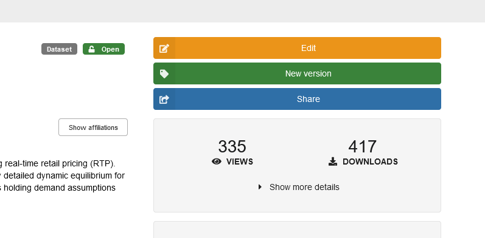
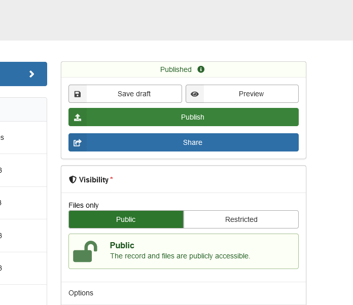
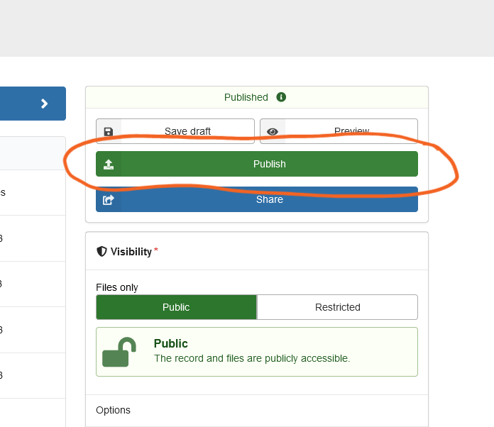
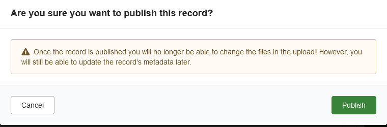
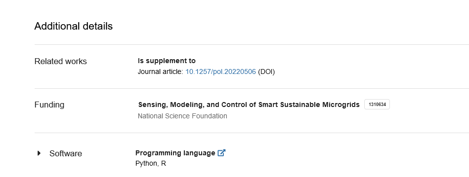

# AEA: Publishing a deposit

## Responsibilities

The complete general sequence is as follows:

1. Publish replication package deposit (openICPSR, others)
2. Publish AEA article
3. Update the "related publication" link using the "Import from DOI functionality."

In general, publication of the deposit is done by the AEA Editorial Office, in synchronization with the publication of a the manuscript.

In certain circumstances, this may also be done by the AEA Data Editor's office. This page describes how to proceed.


```{admonition} Please note:
Always check with your supervisor before attempting to publish a deposit.
```

## Pre-requisites (JIRA)

:::{note}

Fields are in `Publication info` tab, unless otherwise noted.

- [ ] The openICPSR project number must be filled out, if the paper has an openICPSR deposit.
- [ ] The correct `openICPSR version` number needs to be selected.
- [ ] A `replication package DOI` needs to be present (if necessary, run a script).
- [ ] The field `Non-compliant` is not checked (not `Yes`) (in `Other links` tab)
:::

:::{warning}

Some manuscript may have deposits elsewhere. Handling may differ in those cases. Examples include:

- [World Bank Reproducible Research Repository](https://reproducibility.worldbank.org/)
- [Codeocean Open Science Library](https://codeocean.com/explore)
- [Zenodo American Economic Association community](https://zenodo.org/communities/aeajournals/)
- Dataverses, for instance [at Harvard](https://dataverse.harvard.edu/), [Yale](https://dataverse.yale.edu/), and [Canada](https://borealisdata.ca/) 

Instructions for those may not yet exist. 

:::

:::{admonition} One-time administrative setup
:class: dropdown

- [ ] (Administrator for Project) needs to [add user](https://aeadataeditors.atlassian.net/plugins/servlet/project-config/AEAREP/people) to `Publisher` group. 

:::

## JIRA: Move to "Processing Publication"

Select the transition "`Publish`" to move it to "`Processing Publication`". In the popup, verify that all information seems complete. 

## Deposit: Sequences

On openICPSR, the sequence is `Add DOI` -> `Publish`. For other platforms, it often is `Amend publication with DOI`. 

In a separate tab, open the deposit. 

## Deposit: Add DOI


:::::{tab-set} 

::::{tab-item} openICPSR

:::{admonition} Verify that the usual "ready for publication"  communication entry has been added. 
:class: dropdown

- if not, investigate why
:::

Scroll down to the "Related Publications" section.

- Go through the process to add the DOI.
- Remove any related publications that simply say "n.a." in publication info

::::


::::{tab-item} Zenodo

- go to <https://zenodo.org/communities/aeajournals/records> (you need to be a part of the curation team of the American Economic Association Community)


- Find the item, and click on the "Edit" button (**not "New version"**!)



::: {warning}

- If you do not see the "Edit" button, you are not a part of the curation team. Please contact the community manager.

:::

- You should see the "Publish" and "Share" buttons. You will come back to the "Publish" button later. 



- Scroll down "Related works".
- Select
  - `Relation` - `is supplement to`
  - `Identifier` - the DOI in the form of `10.5281/zenodo.1234567` of the manuscript
  - `Scheme` - `DOI`
  - `Resource type` - `Publication / Journal article`


- Scroll back up and click on the `Save draft` button. This should not generate any error messages.


- Now press `Publish`.



- Confirm in the pop-up the publication.




- The new view is the published deposit. Scroll down to the "Additional details" section, and verify that the "Related works" section is correctly populated (there may be other elements there, but the DOI should be listed).




::::

::::{tab-item} Codeocean

Send a note to the helpdesk, requesting the addition of a DOI to the related publications. **Do not create a new version!**

::::

::::{tab-item} Others

In general, for others, you may need to email the repository platform contact.

:::::

## Deposit: Publish


:::::{tab-set} 

::::{tab-item} openICPSR

Move to the next step:

> Change Status -> Publish


Verify the information again, then "Proceed to publish".

Most of the values on the next screen should have been consented to by the authors. However,

- Verify that the data collection is scheduled for "public download." Only in rare cases will this be for restricted-access. 
- Verify that "`Delayed dissemination`" = "`no`". We never use that.


The remaining options are non-selectable. However, verify that the License is correctly chosen - if there is a license file in the deposit, there should be a "`Other license`" selected.

Choose "Publish Project". The project will go public shortly. You should verify that in fact the deposit is publicly accessible at the DOI. Any failure should be reported to openICPSR.

::::

:::::

## JIRA: Move to "Published"

Finalize the process on JIRA. 
