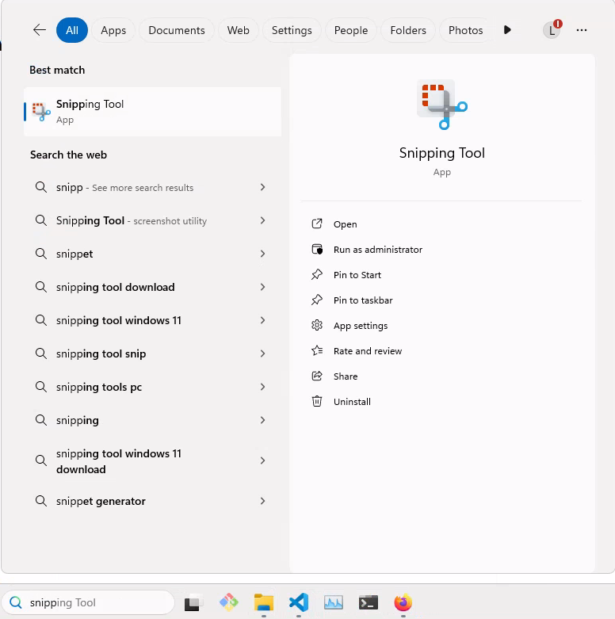
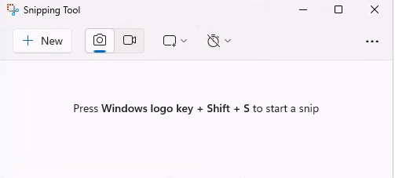
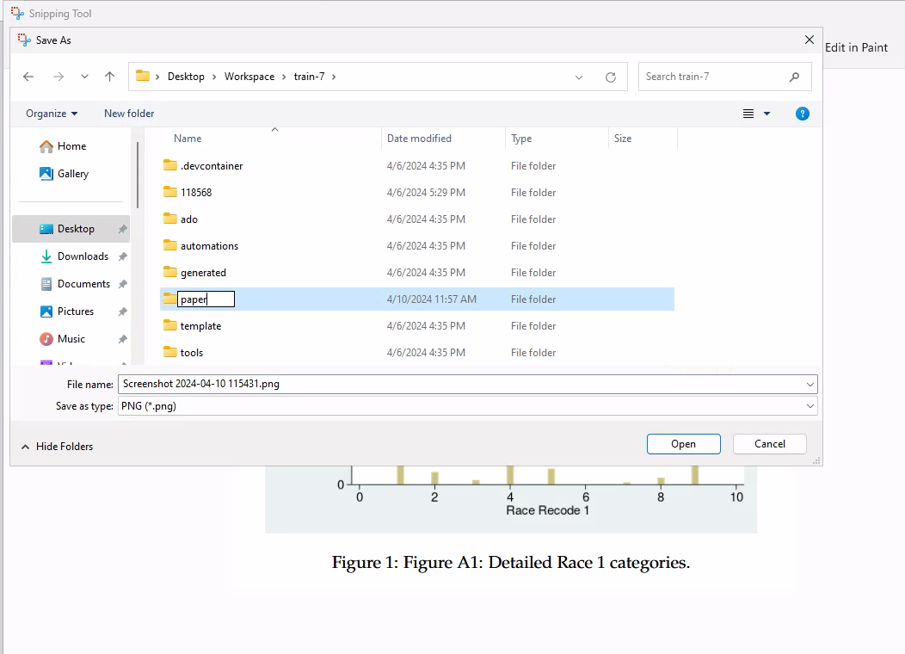
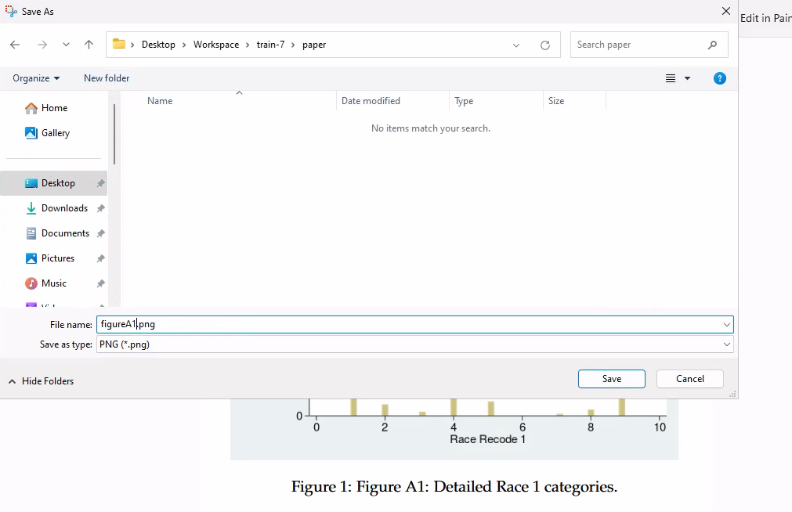
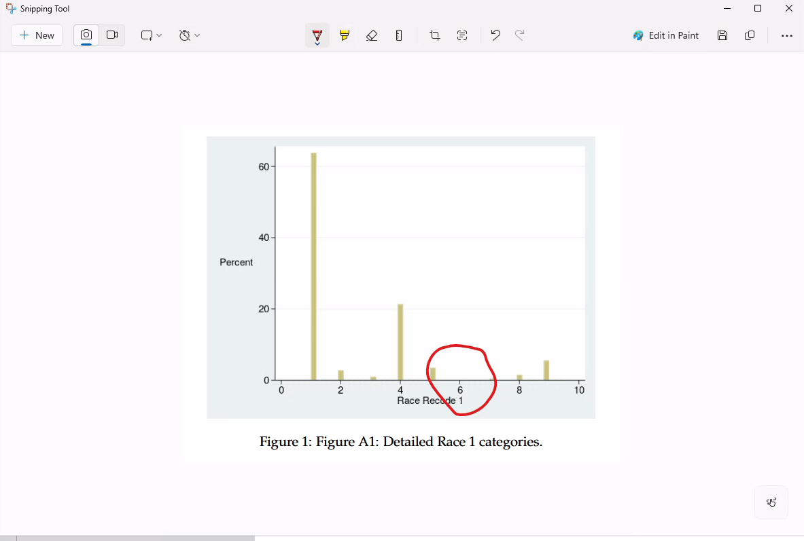
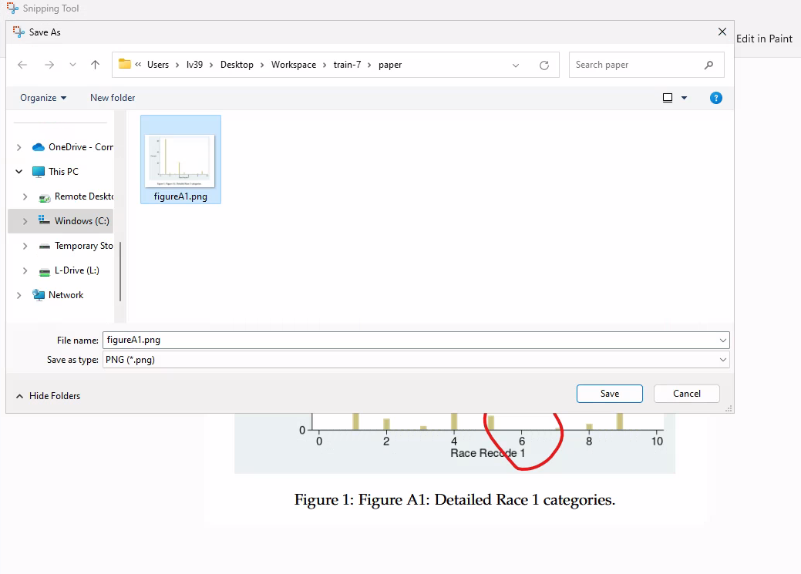

(screenshot-windows)=
# Using screenshot and annotation tools on Windows 

## Search for the " Snipping Tool"

The "Snipping Tool" is a built-in Windows tool that allows you to take screenshots of your screen. You can search for it by typing "Snipping Tool" in the search bar.




You can also pin it to the Start menu or the task bar, for easy and quick access.

```{tip}

You can also use the shortcut `Windows + Shift + S` to open the tool.

```

## Configure the "Snipping Tool"

- You will want to record a picture, not a movie.
- You will want to select a rectangle, not the entire screen or a window.

It should look something like this:



## Take a screenshot

- Open the Snipping Tool.
- Click on "New".
- Select the area you want to capture.


## Save the screenshot

For the purposes of the reproducibility check, you should call the file something that represents the table or figure you are capturing. 

- If you are capturing a table from page 3, you could call the file `table3.png` and save it in a **new** directory called `paper/`.
- If you have only a few screenshots, save it in the project root as `table3-paper.png`. 
- Avoid spaces in the file name.
- Do not use the default name `Screenshot YYYY-MM-DD HHMMSS.png` as it is not descriptive, and contains spaces.






## Annotate the screenshot

You can use the "Snipping Tool" to annotate the screenshot. You can do this before saving the screenshot, or afterwards. If the latter, simply save over the original screenshot.





:::{tip}

Other tools may also exist - choose your favorite tool!

:::

You can now [include the screenshots, and the original picture, in the report](include-screenshots).

