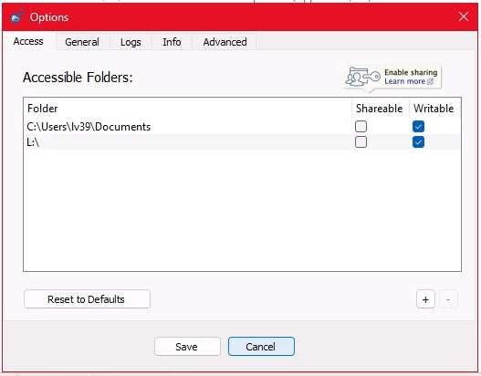
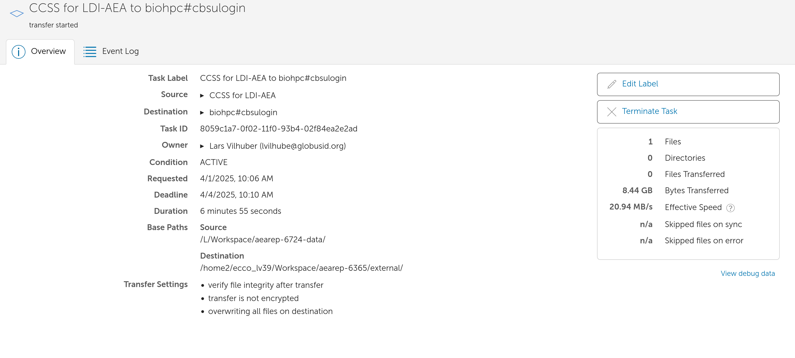

(globus-transfers)=
# Globus Transfers

Globus is a file transfer service that allows you to transfer large amounts of data between different systems. It is particularly useful for transferring data between BioHPC and CCSS Cloud, as well as between different research institutions.

There are two components to using Globus: the web interface, and (in our case) the taskbar icon on CCSS Cloud.

## Globus setup

- create a Globus account
- configure the personal Globus endpoint on CCSS Cloud (call it `CCSS for LDI-AEA`)

## Globus on CCSS Cloud

Look for the Globus icon on the desktop: 

. 

- Click on it. If it says "Another instance is running", you are all set.
- Now look for the Globus icon to the right in the Windows taskbar. Right-click on it and select `Options`:



- Ensure that it contains at least the following entry:

```
L:\
```

## Transferring files

Transferring files is triggered from the [Globus web interface](https://app.globus.org/file-manager). You will need to log in with your Cornell credentials. You can then select the source and destination systems, and transfer files between them.

### Select the CCSS "endpoint"

In the navigation pane, you should be able to search for `CCSS for LDI-AEA` or whatever you called it in the `Collection` field. By default, it will open on the first entry in the list configured earlier. Go "up one folder", and you should see "/L/". Select it, and navigate to the folder where the files or folders are located you wish to transfer.


On the right panel, you will see `Transfer or Sync to...`. Select it. You will see a second pane, similar to the first one. In the `Collection` field, search for "biohpc cornell". You should see 

```
biohpc#cbsulogin
biohpc#cbusulogin2
biohpc#cbsulogin3
```

Select any one of them, you may need to authenticate with your BioHPC login credentials. 

In the `Path` field, type `/home2/ecco_lv39/Workspace`. You should now see the list of directories there. Navigate to where you want to put the file. For instance,

```
/home2/ecco_lv39/Workspace/aearep-xxxx
```

where `xxxx` is the number of the replication package you are working on. 


Now start the transfer in the direction you wish to transfer, see the `[Start]` button above the pane where you want to transfer files FROM.


Your transfer will be queued. The pop-up will allow you to view the progress of the transfer (click on it):



:::{warning}

While the transfer is in progress, you should NOT log out of the CCSS Cloud instance. If you do, the transfer will be interrupted.

:::

