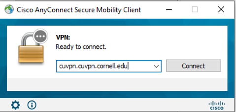
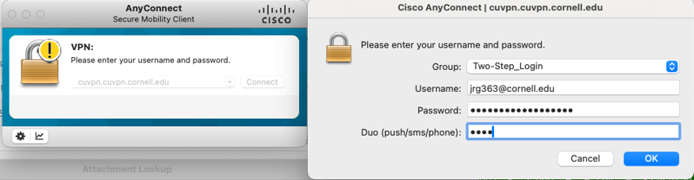
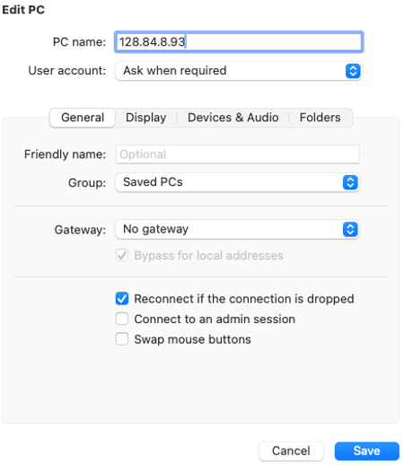
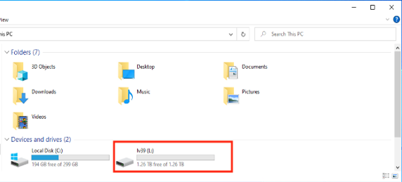

(windows-remote)=
# Connecting to remote Windows servers

We have access to two sets of remote desktop Windows servers:

- CCSS-RS (classic)
- Cloud CCSS (beta)


:::::{tab-set}


::::{tab-item} Cloud CCSS


- [Instructions](https://cornellprod-my.sharepoint.com/:f:/g/personal/cd642_cornell_edu/EvxDKmDjZyZBsrQvimUR8xABE4x6TYDenmLOY8ZFMLRjUw)

:::{admonition} Please be sure to do this:

- use the L drive for all "Workspace" folders (i.e., the clone of the Bitbucket repository)
- use the D drive for those that are large and need fast storage (but be aware that D drive is also wiped)
-  **ALWAYS**  `git commit` and `git push`  all changes before you logout, every time you log out.

:::


:::{warning}

Please note that anything saved in the C drive (Documents, Desktop, or Download folders) and D drive may be deleted at any time (reboot/security update), and there is no way to recover the deleted files.

:::


Please be sure to follow all instructions, in particular the ones about mapping network drives. 

You can connect to CCSS Cloud Computing via a **web browser** or via the a Remote Desktop (RDP) client. Note that for some strange reason, Windows users need to use a DIFFERENT RDP client than the one that comes with their system (and used for CCSS classic). See the [instructions provided by CCSS](https://cornellprod-my.sharepoint.com/:f:/g/personal/cd642_cornell_edu/EvxDKmDjZyZBsrQvimUR8xABE4x6TYDenmLOY8ZFMLRjUw) and [this link at Microsoft](https://learn.microsoft.com/en-us/windows-server/remote/remote-desktop-services/clients/remote-desktop-clients) for the right client for your laptop's OS. Web browser instructions are below, for convenience.

- Open the latest version of a web browser (Chrome, Safari, Firefox or Edge). · Go to following link: [https://client.wvd.microsoft.com/arm/webclient/](https://client.wvd.microsoft.com/arm/webclient/) (V1) or the newer one [https://client.wvd.microsoft.com/arm/webclient/v2/index.html](https://client.wvd.microsoft.com/arm/webclient/v2/index.html) (V2)
 
- Sign into Microsoft with your regular Cornell University email and password. 
  -  Cornell email address. Ex: jrg363@cornell.edu
  -  Cornell email password. Ex: Cornell password 

- Click on "Research Servers", and on the pop-up, click on Allow to proceed. 
- Sign in (again) with your regular Cornell University email and password. 
  - Username: Cornell email address. Ex: jrg363@cornell.edu
  - Password: Cornell email password. Ex: Cornell password

**Mapping Network Drives**

- You should map the following network drive, following the **instructions** linked above (see the document "**3. Cloud Storage**")
  - `\\ccssilr.file.core.windows.net\lv39` to drive letter `L:` (you can call it "LDILab Drive")
  - We will be using that drive letter often (including to replace the `S:` drive from the CCSS classic nodes).

- When instructed, you may also need to map the old S-drive:
  - `\\rschfs2x.ciserrsch.cornell.edu\share\LDIlab`
  - Select “Connect using different credentials”
    - CISER username: `ciserrsch\[netID]_RS` (where `[netid]` is replaced by... your NetID!)
    - Check the box "Reconnect at login" 


**Signing out or disconnecting**

- If you have set a replication package's code to run, **do not sign out/ log off** - disconnect. 
- If you are done for a few days, and have nothing running, then **sign out**. 

**Disconnecting**

Close the browser tab, or close the application by the usual methods. This will leave your code running!

::::

::::{tab-item} CCSS-RS classic

```{warning}
These instructions are here for informational purposes only. You should be using the CCSS Cloud servers at this time.
```

Follow instructions at [CCSS-RS](https://socialsciences.cornell.edu/research-support/login-instructions). Be sure to select the tab that corresponds to your **laptop's** operating system!


**Disconnecting**

- If you have set a replication package's code to run, **do not sign out/ log off** - disconnect. 
- If you are done for a few days, and have nothing running, then **sign out**. 

::::

:::::


**Signing out**

It is important to sign out when you do NOT have jobs running. However, when you no longer have a job running, it saves everybody resoures. Your data will still be accessible when you sign back on. 

*Manually*

-  Open Start Menu
- Click on the Profile icon of your name on the left.
- Select 'Sign out'


*Automatically*

To configure your job to sign out automatically at the end, these are the instructions [provided by CCSS](https://socialsciences.cornell.edu/computing-and-data/cloud-computing-solutions/account-instructions?toptab=session_tips&contenttab=auto_sign_out_after_code_completes):


::::{tab-set}


:::{tab-item}  Stata

```stata
*Use the code below at the bottom of the Stata "main" or "master" script to automatically sign out 

shell shutdown -l 
```


:::

:::{tab-item} R

```r
# Add to end of main or last script.
system("shutdown  -l")
```


:::

:::{tab-item} Matlab

```
%Use code below at end of MATLAB main script, or last script, to automatically sign out

system("shutdown -l")
```


:::

:::{tab-item}  Python

```python
%Use code below at bottom of Python/Anaconda script to automatically sign out

import os

os.system("shutdown -l")
```

:::

::::

(Red-Cloud)=
## Accessing RedCloud Server

1.	Install and Connect to CU VPN (instructions linked below)

https://it.cornell.edu/cuvpn

2. Once you have the VPN installed, enter ‘cuvpn.cuvpn.cornell.edu’


Username is Cornell netid with ‘@cornell.edu’ extension
Password is normal Cornell account password
‘Duo’ or ‘second password’: 
Type ‘push’ – Sends DUO push to phone
Type ‘sms’ – Sends message to Cornell email inbox
Type ‘phone’ – Receive a phone call. 




3. Set RedCloud account password using  https://passwordreset.computing.socialsciences.cornell.edu/
Enter username as netid_RS when setting password. Ex: jrg363_RS

4. Install the 'Remote Desktop' client:

(Instructions taken from [CCSS](https://socialsciences.cornell.edu/computing-and-data/cloud-computing-solutions/account-instructions?toptab=login_instructions&contenttab=mac))
#### Windows Remote Desktop


[Download Remote Desktop](https://go.microsoft.com/fwlink/?linkid=2068602) for Windows Users

Install the downloaded client application
Click through installation and accept the default settings

Initial ‘Remote Desktop’ Setup (to be done only once):
- Open ‘Remote Desktop’ client application installed from earlier step
- Click ‘Subscribe with URL’ 
- Input the following URL.: https://rdweb.wvd.microsoft.com/ 
- Click ‘Next’

#### Mac Remote Desktop

[Download Remote Desktop](https://itunes.apple.com/us/app/microsoft-remote-desktop-10/id1295203466) for Mac Users

Initial ‘Microsoft Remote Desktop’ Setup (to be done only once) 
- Open ‘Microsoft Remote Desktop’ from Applications ‘Workspaces’ tab  
- Click Plus icon, ‘Add Workspace’
- Input the following for ‘Email or workspace URL’: https://rdweb.wvd.microsoft.com
- Click ‘Add’ 


4. Open Remote Desktop and click "Show options"

Change “Computer” or “PC Name” text box to IP address below (depending on Mac or Windows). Enter username as ciserrsch\netid_RS when signing in. ex: ciserrsch\jrg363_RS

**IP Address: 128.84.8.93**




Continue log in using the password you created in step 3
### Accessing the L Drive

1. Open File Explorer
2. Click ‘This PC’
3.	Underneath ‘Devices and Drives’ you will see the L: drive titled ‘lv39’

