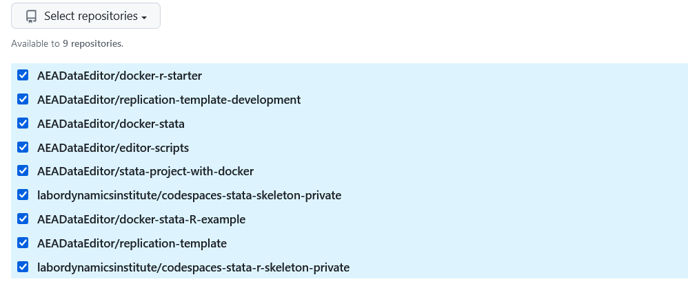

(computing-using-cs)=
# Computing using Github Codespaces

## Setup

- Go to your [personal Codespace settings on Github](https://github.com/settings/codespaces)
- Add the following `Codespaces secrets` by choosing `New secret`:

- `P_BITBUCKET_PAT`: Your personal access token from Bitbucket (see [here](bitbucket-authentication))
- `P_BITBUCKET_USERNAME`: Your login on Bitbucket

The others are only needed in specific circumstances.

Then choose to apply them to specific repositories:

## Start an environment on Github Codespaces

- Go to [https://github.com/labordynamicsinstitute/codespaces-stata-skeleton-private](https://github.com/labordynamicsinstitute/codespaces-stata-skeleton-private) and select "Code -> Codespaces -> Create Codespace on main"
- When you have one running, you can re-use the previous one. It will show in the popup, or on [https://github.com/codespaces](https://github.com/codespaces).

Alternate:

- Go to [https://github.com/codespaces](https://github.com/codespaces) and select `labordynamicsinstitute/codespaces-stata-skeleton-private` or `labordynamicsinstitute/codespaces-stata-r-skeleton-private` from the dropdown menu (you may need to search).

If neither of those options appear, contact the LDI Lab Administrator.

## Connect to local VS Code (optional but useful)

- Click on the green `Codespaces` button on the bottom left, choose "Open in VS Code" from menu that appears at top center.
- This will open a local VS Code instance with the same content. Your main window in the browser may or may not stay open.

## Processing cases

- Open a terminal (top menu, Terminal, New Terminal, or shortcut `shift-ctrl-\``.
- `cd ..` to be in `/workspaces`
- You can clone a Bitbucket case as usual. 
  - special command available: `aeagit [NNNN] http` where `[NNN]` is the `AEAREP-NNNN` number. The command should open a new VS Code instance, with the cloned repository in the file pane.
- All command line git functions should work, as should command line Stata.

## Administrator instructions

In order to enable a replicator to use this repository for Codespaces, they must be "collaborators". Apparently, that requires write access (to be verified).

## Older instructions

([experimental instructions](https://github.com/labordynamicsinstitute/replicability-training/blob/master/draft-codespaces.md))