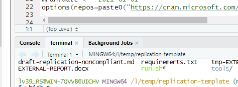

(running-code-in-r)=
# Running Code in R

Although, there are plenty of ways to run code in R, our goal with these instructions is to show the easiest way to do it, by minimizing both the manual steps replicators have to go through and the chance of making a mistake that prevents a successful run.

## Why do we need log files?

- Log files record each step of the analysis and its results as a text. It also records error messages if you encounter any error upon running the code.
- There are other purposes to have log files, but for us, it is to communicate with other team members. 
    - When a replicator submits the report, a preapprover (and an approver) needs to verify how the code ran. It is to ensure that any discrepancies we find are not due to mistakes on our end.
    - A log file is crucial for this verification. Otherwise, preapprovers and approvers have to run the code again to verify which is not an ideal use of time, nor an efficient way to process the case.

:::{admonition} The following instructions are for Windows.

See [Instructions for BioHPC](r-on-biohpc) for running R code generally on Linux, and specifically on BioHPC.

:::

## Step 1: check for a "main" .R file

A `main.R` file is a R script that will call, in the correct sequence, all the programs necessary to construct analysis datasets, do all computations, and produce figures and tables. If a `main.R` file exists, it should be mentioned in the README. In most cases, running a single `main.R` file is sufficient to complete the reproduction. In general, a main script does not need to be a .R file. However, we will focus on cases where all work done in R is reduced to executing a single .R file.

```{note}
If there is no `main.R` file, you should create one. See [previous section](using-config-r).
```


## Step 2: Run the Code

We will run R from the command line to create log files. We will use the `main.R` file to run the code.

```{note}
If the R code fails, you will see this in the `Rout` file, which you can open in VS Code. It is OK to debug using Rstudio, but the final (clean) run after all debugging, or any run that needs outside help, needs to be logged, and run from the command line.
```

### Setting up the environment to run the code

::::{tab-set}

:::{tab-item}  Windows

```{tip}
The most convenient way to run from the command line is to use Rstudio. Open Rstudio, and configure the **Terminal** as follows:
```

- Click on the Terminal tab in the bottom left corner of Rstudio
- Click on the downward-arrow to open up the menu for Terminal. Select `Terminal Options...`


- Select "Git Bash" from the options.


- Click "OK"

- Now open up the Terminal tab in the lower-left corner of the RStudio window:




:::

:::{tab-item} Mac/Linux 

On Unix-style systems, the preferred way is to use the Terminal to run R code (you can also call up RStudio and run from the "Terminal" tab as on the Windows tab).

Open up a Terminal in the folder where the `main.R` file is located - this may differ depending on your system, and may involve using "`cd /path/to/code`" commands. Confirm with "`ls`" that you see the same files you might see in Finder / File Explorer. Refer to the command line training in the initial training.

On **BioHPC**, you may need to choose your R version, every time you launch a terminal (see [BioHPC documentation for more details](https://biohpc.cornell.edu/lab/userguide.aspx?a=software&i=37#c):

```
module load R/4.3.2
```

Type 

```
module avail
```

to see which R versions are available. 

::: 

:::{tab-item} BioHPC RStudio Server

A web-based approach can be used on BioHPC. 

- The first user logging on to a BioHPC node (new reservation) can launch "rstudio server", which then makes the web interface of Rstudio accessible to anybody on that server. See [https://biohpc.cornell.edu/lab/userguide.aspx?a=software&i=266#c](https://biohpc.cornell.edu/lab/userguide.aspx?a=software&i=266#c) for details.
- For instance, if the reservation is on `cbsuecco08`:
  -  open CiscoVPN and connect
  -  connect to http://cbsuecco08.biohpc.cornell.edu:8016/
  -  log in with your netid and your BioHPC password

To generate a log file, you must still run R code from the terminal with `R CMD BATCH` (below).

The RStudio server instance only runs the latest R code. For running other R versions, refer to the "Mac/Linux" tab.

:::

::::

### Run the code

Once the above is done, running R is simple:

```bash
R CMD BATCH --verbose --vanilla main.R main.$(date +%F_%H-%M-%S).Rout
```

This will create a `main.(DATE).Rout` file, which you can open up in VS Code. You must commit this file to Bitbucket. Every run will create a new `main.(DATE).Rout` with a slightly different date-stamp.

:::{note}

If the author's main filename has spaces in it, you will need to use quotes when inputting the filename into the bash command to say `R CMD BATCH "Main File.R"`

:::

::::{admonition} If the author uses `Rscript` ...
:class: tip dropdown

... then use the following command line (adjusting the authors'  accordingly)

```
RScript  --verbose main.R > main.$(date +%F_%H-%M-%S).Rout 2>&1 
```

::::

> Consider how much time a complete run would take before you run everything one last time. If it would take too long, you may want to skip a complete run, but ensure that you have log files for all partial runs. Make a note of this in the report.


## Possible failures

### `main.R` and `.Rprofile` are not in the same directory

If the `main.R` file is not in the root directory (i.e., the same directory as the `.Rprofile` file), then you need to use a workaround. Call the `main.R` file from a wrapper script in the root directory, or using the source command directly:

```bash
R  --no-restore -e 'source("scripts/main.R")' main.$(date +%F_%H-%M-%S).Rout
``` 


### Use of Rstudio API

We sometimes see authors use the Rstudio API. In most cases, this will prevent the code from running in the `R CMD BATCH` method. Also in most cases, this can be remedied easily.

For instance, the following code leverages the Rstudio API to figure out the location of the code: 

```R
setwd(dirname(rstudioapi::getActiveDocumentContext()$path))
```

If using the  [`config.R`](using-config-r) setup, this can be easily replaced with 

```R
setwd(rootdir)
```

or 

```R
setwd(file.path(rootdir,"code")
```

(if the file in question is in a subdirectory of the rootdir)

### Failure due to `renv`

The package management system `renv` needs to be initialized. Possible failures include:

* the required `.Rprofile` file is missing (it is hidden from view in the file browser, but it must be there).

Solution: create a minimal `.Rprofile` file in the root directory with the following content:

```R
source("renv/activate.R")
```

* the `renv` environment was not initialized.

The first time running code on a system, `renv` needs to restore packages.

Solution: Add the following line to the authors' `main.R`, before any other code that uses packages:

```R
renv::restore()
```

You might also simply need to invoke R (in the same directory as the `renv` setup) and run `renv::restore()` once manually.

### Failure due to `segmentation fault`

On CCSS Cloud, running R code that requires a high amount of memory can cause R to fail. 

Solution 1: Check how much memory storage is available in CCSS Cloud in the Task Manager and run the R file when memory is highest (usually at night)

Solution 2: Run the main file, but call only one R file at a time by commenting out all of the other R files. Rerun the main file for each additional R file that is included in the main file.
